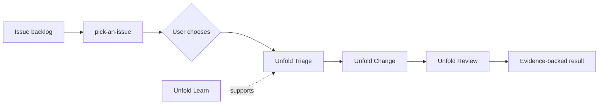

# Agentic Engineering, Applied

**Evidence-driven methods, dogfooded on real engineering work.**

These skills turn real engineering work into portable agent protocols. They favor retrievable evidence over confident prose and keep public methods agnostic across repositories, stacks, editors, and agents.

## Skills

### Unfold

[Unfold](skills/unfold) carries one unfamiliar-codebase mission through the earliest unfinished mode:

| Mode | Outcome |
|---|---|
| Learn | Evidence-backed architecture, flow traces, progressive zoom, and reconstruction |
| Triage | Deterministic red signal, failure map, surviving hypothesis, and Change Surface |
| Change | Complete implementation under `guided`, `execute`, or `execute-with-approval` collaboration |
| Review | Change Surface review, revert proof, restored green, and artifact verification |

The modes reuse one mission and evidence chain instead of restarting repository exploration at every phase.

### Pick an Issue

[Pick an Issue](skills/pick-an-issue) surveys an external backlog, qualifies three to five candidates, presents an evidence-backed comparison matrix, recommends one, and lets the user make the final choice. It ends at selection and hands a bug to Unfold Triage or a specified enhancement to Unfold Change.

## Candidate skills

Candidate skills are installable for dogfooding but remain experimental until a Foundry round demonstrates value against a baseline.

### Record a Case

[Record a Case](skills/.experimental/record-a-case) captures completed, interrupted, or backfilled maintenance work as an evidence ledger. It keeps validation, human review, maintainer acceptance, and delivery independent.

## Workflow



Each mode can also be entered directly. A diff can begin at Review; a read-only question can remain in Learn.

## Maturity

v0.0.1 is an honest first release, not a validation claim. Both public skills are **dogfooded**. The consolidated Unfold protocol and the Pick an Issue selection matrix still need controlled comparisons against no-skill and prior-skill baselines.

The source of truth is [foundry/maturity.json](foundry/maturity.json).

| State | Meaning |
|---|---|
| experimental | Coherent method and trigger boundary, without real-work use |
| dogfooded | Used on real work, without a reliable baseline comparison |
| evaluated | Compared against a baseline, but evidence remains incomplete or inconclusive |
| validated | Repeatable positive effect across holdouts and trials, with human review |
| deprecated | Retained for provenance but no longer recommended |

## Install

Install interactively into supported agents:

```bash
bunx skills add Railly/skills
```

The interactive installer groups skills under `Stable` and `Candidates`; `record-a-case` also identifies itself as a candidate in its description. Install only the stable surface with:

```bash
bunx skills add Railly/skills --skill unfold --skill pick-an-issue
```

Install the candidate explicitly with:

```bash
bunx skills add Railly/skills --skill record-a-case
```

`--all` includes experimental candidates.

Or clone and link one skill:

```bash
git clone https://github.com/Railly/skills.git ~/railly-skills
ln -s ~/railly-skills/skills/unfold ~/.claude/skills/unfold
```

For Codex, Cursor, and other compatible agents, install or link the same folder under the corresponding project or personal skills directory.

## Repository structure

```text
skills/                 stable installable surface
skills/.experimental/   installable candidates awaiting evaluation
cases/                  public-safe evidence ledger
foundry/                governance, lessons, eval rounds, and decisions
scripts/                deterministic validation and eval machinery
```

Stable skills stay flat. Candidate skills use the standard `skills/.experimental/` catalog recognized by the skills CLI. The plugin manifest supplies the visible `Stable` and `Candidates` installer groups.

## Skill foundry

Real work becomes a case before it becomes an instruction:

```text
maintenance work
→ case
→ candidate lesson
→ baseline comparison
→ human review
→ promote, absorb, or reject
```

Read the [foundry overview](foundry), [governance](foundry/governance.md), [eval protocol](foundry/eval-protocol.md), and [case template](foundry/case-template.md). Historical methods absorbed into Unfold are recorded under [foundry/deprecated](foundry/deprecated).

Public issues and pull requests may become public cases. Confidential evidence stays in an organization-approved private system; only generalized, sanitized lessons cross into this repository.

## Validate

```bash
bun scripts/validate-skills.mjs
bun scripts/verify-eval-fixtures.mjs
```

CI checks frontmatter, progressive disclosure, internal links, maturity metadata, public-case boundaries, eval metadata, and executable fixtures.

## License

MIT (c) Railly Hugo
