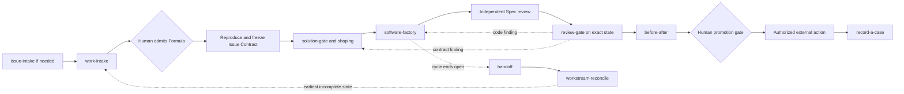

# Agentic Engineering, Applied

**Evidence-driven methods, dogfooded on real engineering work.**

These skills turn real engineering work into portable agent protocols. They favor retrievable evidence over confident prose and keep public methods agnostic across repositories, stacks, editors, and agents.

## Skills

### Issue Intake

[Issue Intake](skills/issue-intake) surveys an external backlog, qualifies three to five candidates, presents an evidence-backed comparison matrix, recommends one, and lets the user make the final choice. It can use `xref` as an optional graph backend, but keeps qualification and selection at the skill boundary. It ends at selection and creates the canonical Issue Contract seed.

### Record a Case

[Record a Case](skills/record-a-case) captures completed, interrupted, or backfilled maintenance work as an evidence ledger. It keeps validation, human review, maintainer acceptance, and delivery independent, then records one compiled-knowledge disposition: link an existing pattern, create a candidate pattern, preserve a gap, or make no compiled change.

### Review Gate

[Review Gate](skills/review-gate) runs a pre-review pass on a diff before pushing: deterministic checks first, then focused review lenses selected by what the diff changes. External review findings are harvested back into the catalog.

### Solution Gate

[Solution Gate](skills/solution-gate) orchestrates Shaping before implementation. It freezes an evidence-backed contract, runs isolated Shaping passes, probes their weakest assumptions, feeds evidence back into their fit checks, and gates the surviving shape before detailing, breadboarding, or slicing.

## Issue Contract

The [Issue Contract](foundry/missions) is a phase-neutral state carrier, not an installable skill. It preserves outcome, observed and expected behavior, acceptance IDs, non-goals, invariants, change surface, verification claims, risk, promotion state, and the exact handoff command.

## Candidate skills

Candidate skills are installable methods ready for focused dogfooding.

### Trail Decisions

[Trail Decisions](skills/.experimental/trail-decisions) keeps an append-only implementation decision trail so review can inspect choices and evidence, not only the final diff.

### Signature Repro

[Signature Repro](skills/.experimental/signature-repro) investigates platform-specific or hardware-dependent bugs through structural and visual signatures observable on available machines.

## Experimental skills

Experimental skills have coherent trigger and method contracts, but still need real-work cases and baseline comparison.

### Before After

[Before After](skills/.experimental/before-after) turns a bug fix, feature, benchmark, or migration into a minimal browser-openable comparison. It puts old and new behavior on one shared basis, supports screenshotable visual repros, exact benchmark tables, and small feature simulators, and uses the official Vercel report foundation.

### Factory Loop

[Factory Loop](skills/.experimental/factory-loop) routes one engineering work item through admission, contract, shaping, staged execution, exact-head review, before/after acceptance, human promotion, re-entry, and case capture. It enters at the earliest incomplete current state and delegates every phase to its owning skill.

### Handoff

[Handoff](skills/.experimental/handoff) closes a working cycle so the next session resumes without rereading the transcript. It verifies state against git before asserting it, keeps delivery, verification, and human judgment independent, and stacks each session onto the prior document instead of overwriting it. Closed work with a transferable lesson goes to Record a Case instead.

### Herdr Workstreams

[Herdr Workstreams](skills/.experimental/herdr-workstreams) turns a human-selected engineering queue into repo-scoped Herdr workspaces, optionally maintains a single-pane control cockpit, keeps only the lead and required runtime processes persistent, and launches planner or reviewer agents visibly on demand for the skill that owns their method.

### Quality Baseline

[Quality Baseline](skills/.experimental/quality-baseline) identifies repository-wide quality gaps before changes, rejects unsupported findings, and ranks one measurable pilot.

### Performance Proof

[Performance Proof](skills/.experimental/performance-proof) joins profiling, complexity analysis, representative benchmarks, semantic checks, and regression guards before accepting an algorithm or data-structure change.

### Test Strength

[Test Strength](skills/.experimental/test-strength) proves that tests detect the intended defect using falsification, mutation, properties, real boundaries, and artifact checks.

### Resilience Audit

[Resilience Audit](skills/.experimental/resilience-audit) forces timeouts, cancellation, retries, partial state, overload, cleanup, dependency failure, and concurrency paths.

### Security Review

[Security Review](skills/.experimental/security-review) models attackers, assets, authority, and trust boundaries to distinguish exploitable vulnerabilities from hardening, non-security defects, and verification gaps. It emits an exact-state security receipt for Review Gate without taking ownership of the final merge verdict.

### Simplify

[Simplify](skills/.experimental/simplify) reduces code, diff size, duplication, tests, and maintenance surface within a bounded target while preserving behavior and proving that consolidated regression protection still detects defects.

### Software Factory

[Software Factory](skills/.experimental/software-factory) runs an admitted change through staged execution between Solution Gate and Review Gate. It implements, reduces, hardens applicable failure paths, runs Test Strength on the final code, and proves real behavior through independent evidence-producing passes.

### Work Intake

[Work Intake](skills/.experimental/work-intake) assesses one already-selected issue, pull request, or manual request before the factory grants mutation authority. It classifies intent, recommends the minimum workflow, and stops for human confirmation.

### Workstream Reconcile

[Workstream Reconcile](skills/.experimental/workstream-reconcile) treats handoffs as historical leads, revalidates their drift-prone claims against live GitHub, local Git, releases, deployments, and package artifacts, and produces a current read-only operating queue without inferring stalls from age alone.

### Xref

[Xref](skills/.experimental/xref) snapshots the complete reference graph around a GitHub issue or pull request to surface competing work, orphans, structural links, and file-overlap risks before work begins.

## Workflow


```mermaid
flowchart LR
  Select[issue-intake if needed] --> Admit[work-intake]
  Admit --> HumanA{Human admits Formula}
  HumanA --> Contract[Reproduce and freeze Issue Contract]
  Contract --> Shape[solution-gate and shaping]
  Shape --> Factory[software-factory]
  Factory --> Spec[Independent Spec review]
  Spec --> Review[review-gate on exact state]
  Review --> Show[before-after]
  Show --> HumanP{Human promotion gate}
  HumanP --> Deliver[Authorized external action]
  Deliver --> Case[record-a-case]
  Review -.code finding.-> Factory
  Review -.contract finding.-> Shape
  Factory -.cycle ends open.-> Handoff[handoff]
  Handoff --> Reconcile[workstream-reconcile]
  Reconcile -.earliest incomplete state.-> Admit
```

`factory-loop` enters at the earliest incomplete state instead of replaying the whole graph. Inside `software-factory`, the order is implementation, bounded simplification, applicable Resilience Audit, final-code Test Strength, and real-behavior proof.

Not every cycle reaches promotion. When work stops with the cycle still open, `handoff` carries state to the next session; `record-a-case` takes over once the cycle closes and leaves a transferable lesson.

## Maturity

Distribution channel and evidence maturity are separate. Stable contains four canonical skills. Solution Gate is stable by explicit human promotion backed by multiple dogfood runs, while its orchestration redesign and formal baseline comparison remain unevaluated. Candidate and Experimental skills remain installable without implying validation.

The source of truth is [foundry/maturity.json](foundry/maturity.json).

| State | Meaning |
|---|---|
| experimental | Coherent method and trigger boundary, without real-work use |
| dogfooded | Used on real work, without a reliable baseline comparison |
| evaluated | Compared against a baseline, but evidence remains incomplete or inconclusive |
| validated | Repeatable positive effect across holdouts and trials, with human review |
| deprecated | Retained for provenance but no longer recommended |

## Install

Install interactively into supported agents:

```bash
bunx skills add Railly/skills
```

The interactive installer exposes three distinct groups: `Stable`, `Candidates`, and `Experimental`. Install only the stable surface with:

```bash
bunx skills add Railly/skills --skill issue-intake --skill record-a-case --skill review-gate --skill solution-gate
```

Install a candidate explicitly with:

```bash
bunx skills add Railly/skills --skill signature-repro
```

Install an experimental skill explicitly with:

```bash
bunx skills add Railly/skills --skill quality-baseline
```

`--all` includes all three groups.

Or clone and link one skill:

```bash
git clone https://github.com/Railly/skills.git ~/railly-skills
ln -s ~/railly-skills/skills/review-gate ~/.claude/skills/review-gate
```

For Codex, Cursor, and other compatible agents, install or link the same folder under the corresponding project or personal skills directory.

## Repository structure

```text
skills/                 stable installable surface
skills/.experimental/   candidate and experimental installable surfaces
cases/                  public-safe evidence ledger
foundry/                governance, lessons, eval rounds, live runs, and decisions
scripts/                deterministic validation and eval machinery
```

Stable skills stay flat. Candidate and Experimental skills use the standard `skills/.experimental/` catalog recognized by the skills CLI. The maturity registry assigns their distribution channel, and the plugin manifest supplies the visible `Stable`, `Candidates`, and `Experimental` installer groups.

All cases, evals, run reports, decision trails, and Foundry logs follow the [canonical source repository policy](foundry/source-of-truth.md). Installed copies under `.agents/skills`, `.claude/skills`, or another agent directory are read-only distribution surfaces.

## Skill foundry

Real work becomes a case before it becomes an instruction:

```text
maintenance work
→ case
→ candidate lesson
→ bounded proposal packet
→ baseline comparison
→ human review
→ promote, absorb, or reject
```

Build a one-skill proposal packet and record a reviewed outcome with:

```bash
bun scripts/build-proposal-packet.mjs record-a-case --output foundry/runs/proposal-impact/<run>/packet.json
bun scripts/record-impact.mjs foundry/runs/proposal-impact/<run>/impact-record.json
```

Rejected candidates remain queryable in the compiled graph and cannot change the active skill digest. Accepted candidates require passing eval evidence and explicit human authority.

Every supported agent use can also produce a private Skillkit receipt. Routine usage remains telemetry. Reviewed failures, corrections, interruptions, novel transfers, and maintainer feedback can be compiled into sanitized candidates with:

```bash
skillkit receipts --all --json > /private/path/receipts.json
bun scripts/compile-usage-receipts.mjs /private/path/receipts.json
```

The compiler copies no transcript, local path, session ID, or private summary. It creates no canonical case and changes no skill automatically.

Read the [product direction](NORTH.md), [foundry overview](foundry), [compiled knowledge](foundry/knowledge), [governance](foundry/governance.md), [source repository policy](foundry/source-of-truth.md), [Issue Contract workflow](foundry/missions), [eval protocol](foundry/eval-protocol.md), and [case template](foundry/case-template.md). Deprecated methods and the archived Unfold protocol remain under [foundry/deprecated](foundry/deprecated).

Public issues and pull requests may become public cases. Confidential evidence stays in an organization-approved private system; only generalized, sanitized lessons cross into this repository.

## Validate

```bash
bun scripts/validate-skills.mjs
bun scripts/validate-issue-contracts.mjs
bun scripts/validate-knowledge.mjs
bun scripts/compile-knowledge.mjs --check
bun scripts/audit-knowledge-matches.mjs --check
bun scripts/verify-eval-fixtures.mjs
```

CI checks frontmatter, progressive disclosure, internal links, maturity metadata, public-case boundaries, Issue Contracts, compiled knowledge, eval metadata, and executable fixtures. Strict knowledge maturity enforcement joins CI after the four unsupported non-experimental skills gain prospective application evidence or their maturity changes.

## License

MIT (c) Railly Hugo
