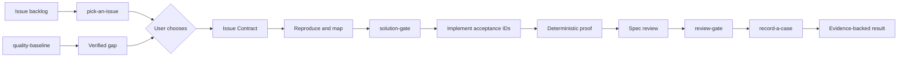

# Agentic Engineering, Applied

**Evidence-driven methods, dogfooded on real engineering work.**

These skills turn real engineering work into portable agent protocols. They favor retrievable evidence over confident prose and keep public methods agnostic across repositories, stacks, editors, and agents.

## Skills

### Pick an Issue

[Pick an Issue](skills/pick-an-issue) surveys an external backlog, qualifies three to five candidates, presents an evidence-backed comparison matrix, recommends one, and lets the user make the final choice. It ends at selection and creates the canonical Issue Contract seed.

### Record a Case

[Record a Case](skills/record-a-case) captures completed, interrupted, or backfilled maintenance work as an evidence ledger. It keeps validation, human review, maintainer acceptance, and delivery independent.

### Review Gate

[Review Gate](skills/review-gate) runs a pre-review pass on a diff before pushing: deterministic checks first, then focused review lenses selected by what the diff changes. External review findings are harvested back into the catalog.

## Issue Contract

The [Issue Contract](foundry/missions) is a phase-neutral state carrier, not an installable skill. It preserves outcome, observed and expected behavior, acceptance IDs, non-goals, invariants, change surface, verification claims, risk, promotion state, and the exact handoff command.

## Candidate skills

Candidate skills are installable methods ready for focused dogfooding.

### Trail Decisions

[Trail Decisions](skills/.experimental/trail-decisions) keeps an append-only implementation decision trail so review can inspect choices and evidence, not only the final diff.

### Signature Repro

[Signature Repro](skills/.experimental/signature-repro) investigates platform-specific or hardware-dependent bugs through structural and visual signatures observable on available machines.

## Experimental skills

Experimental skills have coherent trigger and method contracts, but still need real-work cases and baseline comparison.

### Solution Gate

[Solution Gate](skills/.experimental/solution-gate) gates the shape of a fix before it is written. Two proposers on different model families work from the same symptom-free brief and declare falsifiable predictions; the cheapest refuting probe runs before any synthesis; proposals are scored against a catalog of recorded fix-failure shapes. It sits on the arrow between a reproduced defect and the change that answers it.

### Quality Baseline

[Quality Baseline](skills/.experimental/quality-baseline) identifies repository-wide quality gaps before changes, rejects unsupported findings, and ranks one measurable pilot.

### Performance Proof

[Performance Proof](skills/.experimental/performance-proof) joins profiling, complexity analysis, representative benchmarks, semantic checks, and regression guards before accepting an algorithm or data-structure change.

### Test Strength

[Test Strength](skills/.experimental/test-strength) proves that tests detect the intended defect using falsification, mutation, properties, real boundaries, and artifact checks.

### Resilience Audit

[Resilience Audit](skills/.experimental/resilience-audit) forces timeouts, cancellation, retries, partial state, overload, cleanup, dependency failure, and concurrency paths.

## Workflow


```mermaid
flowchart LR
  Baseline[quality-baseline] --> Gap[Verified gap]
  Backlog[Issue backlog] --> Pick[pick-an-issue]
  Pick --> Choice{User chooses}
  Gap --> Choice
  Choice --> Contract[Issue Contract]
  Contract --> Reproduce[Reproduce and map]
  Reproduce --> Shape[solution-gate]
  Shape --> Change[Implement acceptance IDs]
  Change --> Proof[Deterministic proof]
  Proof --> Spec[Spec review]
  Spec --> Review[review-gate]
  Review --> Case[record-a-case]
  Case --> Result[Evidence-backed result]
```

Enter at the earliest incomplete state. A reproduced issue can begin at implementation, and an existing diff can begin at proof or review.

## Maturity

Distribution channel and evidence maturity are separate. Stable currently contains two dogfooded skills and the evaluated Review Gate. Candidate and Experimental skills remain installable without implying validation.

The source of truth is [foundry/maturity.json](foundry/maturity.json).

| State | Meaning |
|---|---|
| experimental | Coherent method and trigger boundary, without real-work use |
| dogfooded | Used on real work, without a reliable baseline comparison |
| evaluated | Compared against a baseline, but evidence remains incomplete or inconclusive |
| validated | Repeatable positive effect across holdouts and trials, with human review |
| deprecated | Retained for provenance but no longer recommended |

## Install

Install interactively into supported agents:

```bash
bunx skills add Railly/skills
```

The interactive installer exposes three distinct groups: `Stable`, `Candidates`, and `Experimental`. Install only the stable surface with:

```bash
bunx skills add Railly/skills --skill pick-an-issue --skill record-a-case --skill review-gate
```

Install a candidate explicitly with:

```bash
bunx skills add Railly/skills --skill signature-repro
```

Install an experimental skill explicitly with:

```bash
bunx skills add Railly/skills --skill quality-baseline
```

`--all` includes all three groups.

Or clone and link one skill:

```bash
git clone https://github.com/Railly/skills.git ~/railly-skills
ln -s ~/railly-skills/skills/review-gate ~/.claude/skills/review-gate
```

For Codex, Cursor, and other compatible agents, install or link the same folder under the corresponding project or personal skills directory.

## Repository structure

```text
skills/                 stable installable surface
skills/.experimental/   candidate and experimental installable surfaces
cases/                  public-safe evidence ledger
foundry/                governance, lessons, eval rounds, live runs, and decisions
scripts/                deterministic validation and eval machinery
```

Stable skills stay flat. Candidate and Experimental skills use the standard `skills/.experimental/` catalog recognized by the skills CLI. The maturity registry assigns their distribution channel, and the plugin manifest supplies the visible `Stable`, `Candidates`, and `Experimental` installer groups.

All cases, evals, run reports, decision trails, and Foundry logs follow the [canonical source repository policy](foundry/source-of-truth.md). Installed copies under `.agents/skills`, `.claude/skills`, or another agent directory are read-only distribution surfaces.

## Skill foundry

Real work becomes a case before it becomes an instruction:

```text
maintenance work
→ case
→ candidate lesson
→ baseline comparison
→ human review
→ promote, absorb, or reject
```

Read the [foundry overview](foundry), [governance](foundry/governance.md), [source repository policy](foundry/source-of-truth.md), [Issue Contract workflow](foundry/missions), [eval protocol](foundry/eval-protocol.md), and [case template](foundry/case-template.md). Deprecated methods and the archived Unfold protocol remain under [foundry/deprecated](foundry/deprecated).

Public issues and pull requests may become public cases. Confidential evidence stays in an organization-approved private system; only generalized, sanitized lessons cross into this repository.

## Validate

```bash
bun scripts/validate-skills.mjs
bun scripts/validate-issue-contracts.mjs
bun scripts/verify-eval-fixtures.mjs
```

CI checks frontmatter, progressive disclosure, internal links, maturity metadata, public-case boundaries, Issue Contracts, eval metadata, and executable fixtures.

## License

MIT (c) Railly Hugo
