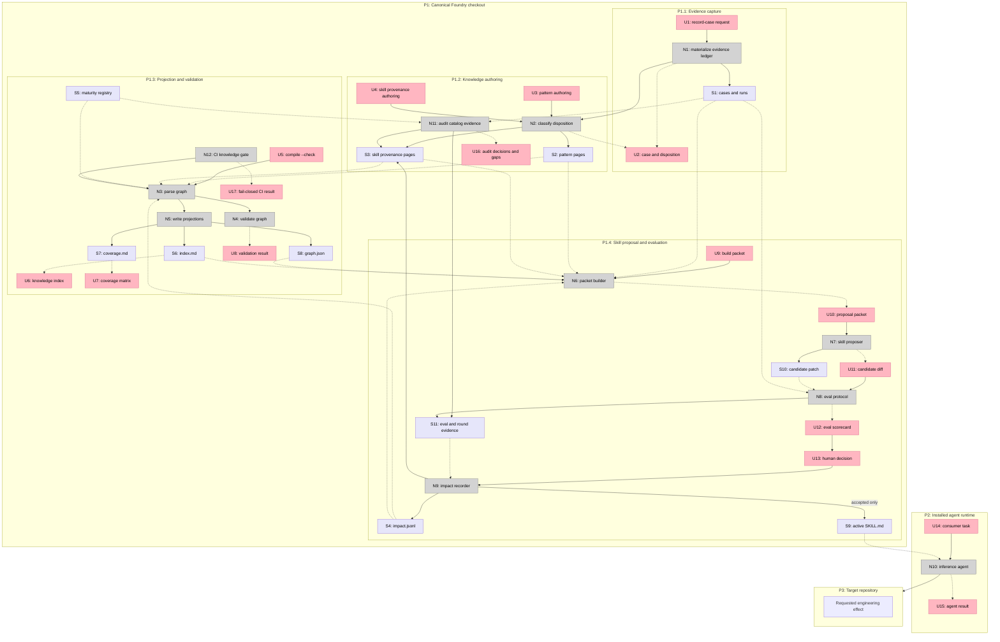
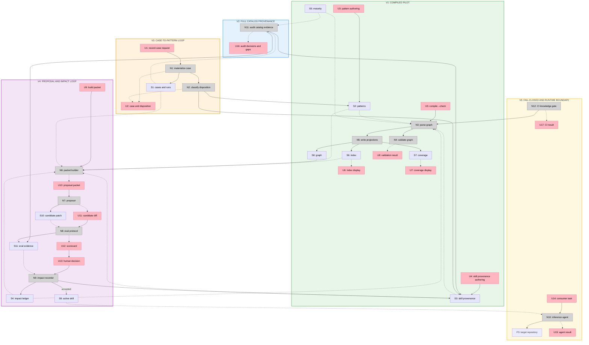

# Compiled Knowledge Layer - Big Picture

**Selected shape:** C, compiled knowledge graph with human-readable pages

**Implementation:** V1 compiled pilot and V2 full catalog provenance are complete. V2 covers 19 of 19 provenance pages and 276 reviewed textual matches with drift fingerprints.

## Frame

### Problem

- Real work is recorded across cases, runs, rounds, candidates, conventions, and skill references, so recurring knowledge must be rediscovered.
- Skill provenance is not a first-class relationship. The maturity registry points to one decision but not the complete evidence, patterns, rejections, and gaps behind the skill.
- Textual skill-name matches cannot distinguish actual application from plans, references, or incidental mentions.
- Rejected and no-change proposals persist in individual rounds but are not compiled into reusable proposer memory.
- Loading the evidence corpus into executing agents would waste context and weaken confidentiality and procedure boundaries.
- Some registered skills have no explicit case linkage, and missing evidence must remain visible instead of being reconstructed plausibly.

### Outcome

- The Foundry has a canonical compiled knowledge layer between evidence and procedure.
- Every registered skill has an auditable provenance page covering cases, runs, rounds, patterns, accepted changes, rejected changes, and gaps.
- Cross-skill patterns compile repeated evidence without copying the full corpus into agent context.
- Executing agents receive promoted procedure only, while maintainers and proposers can progressively disclose compiled knowledge and selected evidence.
- Existing evals, transfer holdouts, maturity rules, confidentiality boundaries, and human promotion remain authoritative.
- Adoption proceeds incrementally without fabricated cases or a mandatory full-corpus rewrite.

## Shape

### Fit Check (R x C)

| Req | Requirement | Status | C |
|---|---|---|:---:|
| R0 | Convert recorded engineering experience into persistent reusable knowledge between evidence and executable skill procedure | Core goal | ✅ |
| R1 | Give every registered skill an auditable provenance record linking its source cases, applied runs, decision rounds, motivating patterns, and current evidence gaps | Must-have | ✅ |
| R2 | Require dogfooded, evaluated, or validated maturity to resolve to retrievable evidence that the method was actually applied, or expose and correct the unsupported claim | Must-have | ✅ |
| R3 | Preserve missing or ambiguous retrospective evidence as an explicit gap instead of fabricating a case or inferring application from a name match | Must-have | ✅ |
| R4 | Support many-to-many relationships so one pattern can inform multiple skills and one skill can be justified by multiple patterns and cases | Must-have | ✅ |
| R5 | Preserve accepted, rejected, absorbed, superseded, and no-change proposals with their rationale and evaluation outcome | Must-have | ✅ |
| R6 | Keep one canonical Foundry-only source of truth and prevent the full knowledge corpus from entering installed skill packages or target repositories | Must-have | ✅ |
| R7 | Give executing agents only active skill procedure while allowing maintainers and proposers to query compiled knowledge and selected source evidence | Must-have | ✅ |
| R8 | Keep the existing no-skill, released-skill, candidate-skill, transfer-holdout, and human-promotion gates authoritative | Must-have | ✅ |
| R9 | Preserve public and approved-private boundaries, store observable evidence rather than hidden reasoning, and reject secrets, private review text, customer data, and unsafe local context | Must-have | ✅ |
| R10 | Provide progressive disclosure through a concise index before a maintainer or proposer opens detailed patterns, skill provenance, cases, or runs | Must-have | ✅ |
| R11 | Validate missing links, invalid relationship types, unsupported maturity, duplicate identifiers, and stale generated projections deterministically | Must-have | ✅ |
| R12 | Support incremental backfill across the current catalog without requiring a full corpus rewrite before the first useful result | Must-have | ✅ |
| R13 | Represent contradiction, supersession, and staleness without deleting the historical evidence that produced an earlier conclusion | Must-have | ✅ |
| R14 | Make each proposed procedural change atomic to one skill and trace it to the patterns and evidence that motivated it | Must-have | ✅ |
| R15 | Allow cross-model or cross-agent transfer results to be recorded so model-specific workarounds do not silently become universal procedure | Nice-to-have | ✅ |

### Parts

| Part | Mechanism | Flag |
|---|---|:---:|
| **C1** | **Authored knowledge sources** | |
| C1.1 | Pattern pages store stable IDs, status, summaries, root causes, strategies, exceptions, typed evidence, affected skills, and history | |
| C1.2 | Skill provenance pages store evidence, patterns, decisions, and explicit gaps for every registered skill | |
| C1.3 | An append-only impact ledger records every proposed skill change, its inputs, eval outcome, human decision, and supersession | |
| **C2** | **Compilation and validation** | |
| C2.1 | A shared parser compiles authored pages and typed relationships into one in-memory graph | |
| C2.2 | A compiler writes or checks the compact index, coverage matrix, and machine graph | |
| C2.3 | A validator rejects invalid IDs, paths, relationships, public-safety boundaries, duplicate impacts, and unsupported maturity | |
| C2.4 | Existing catalog validation and CI invoke knowledge validation after backfill can land green | |
| **C3** | **Case compilation** | |
| C3.1 | `record-a-case` records link-existing, create-candidate, coverage-gap, or no-change as its knowledge disposition | |
| C3.2 | Case compilation edits knowledge sources but never an installable skill | |
| C3.3 | A name match becomes evidence only after its source is read and the relationship classified | |
| **C4** | **Atomic proposal and impact loop** | |
| C4.1 | A packet builder returns one skill's provenance, patterns, impact history, outcomes, and selected source evidence | |
| C4.2 | A proposer creates one skill patch or no-action result from the bounded packet | |
| C4.3 | Existing behavior, trigger, transfer, and human-review gates decide promotion | |
| C4.4 | Every outcome enters the impact ledger, while only accepted outcomes change the active skill | |
| **C5** | **Runtime and confidentiality boundary** | |
| C5.1 | Installed agents receive active skill procedure and promoted references only | |
| C5.2 | Public relationships contain public or sanitized handles; private evidence stays behind bounded approved pointers | |
| C5.3 | Observable commands, outputs, diffs, artifacts, and decisions are eligible evidence; hidden reasoning and secrets are not | |
| **C6** | **Incremental adoption** | |
| C6.1 | The first slice proves one evidence-rich skill and one gap-only skill | |
| C6.2 | The catalog audit creates every provenance page and classifies every textual match | |
| C6.3 | Fail-closed maturity enforcement activates only after the audit can land green | |

### Breadboard

**Legend:**

- Pink nodes are user-visible inputs and outputs.
- Grey nodes are workflows, scripts, validators, or agents.
- Lavender nodes are authored or generated state.
- Solid lines are control or writes.
- Dashed lines are returns or reads.

## Slices

### Sliced breadboard

### Slice grid

|  |  |  |
|:---|:---|:---|
| **V1: COMPILED PILOT** ✅ COMPLETE  • Pattern and provenance schema • Compiler, validator, projections • `review-gate` rich evidence • `before-after` explicit gap  *Demo: compile and break one relationship* | **V2: FULL CATALOG PROVENANCE** ✅ COMPLETE  • 19/19 provenance pages • 276 textual matches classified • Unsupported gaps preserved • Match fingerprints enforced  *Demo: inspect any skill from one coverage report* | **V3: CASE-TO-PATTERN LOOP** ⏳ PENDING  • Extend case schema • Add knowledge disposition • Link or create pattern • Never mutate a skill  *Demo: record a case and regenerate the index* |
| **V4: PROPOSAL AND IMPACT LOOP** ⏳ PENDING  • Build bounded packet • Propose one atomic patch • Run existing eval protocol • Preserve rejection history  *Demo: reject a patch without losing its lesson* | **V5: FAIL-CLOSED AND RUNTIME BOUNDARY** ⏳ PENDING  • Join provenance to maturity • Add CI enforcement • Verify installed package boundary • Synchronize public docs  *Demo: unsupported maturity fails, installed execution works* |  |
