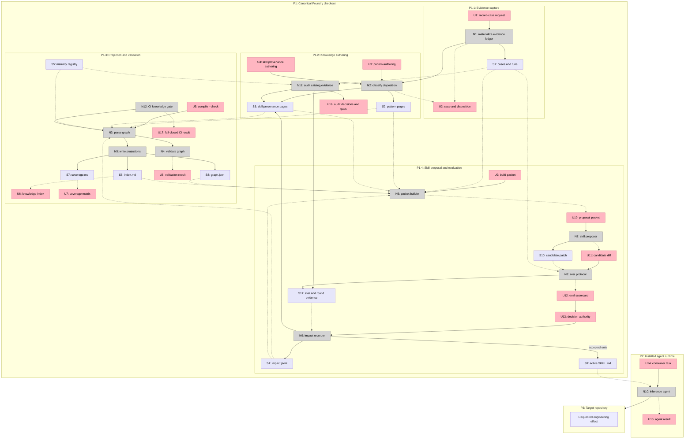

# Compiled Knowledge Layer Shaping

## Requirements

| ID | Requirement | Status |
|---|---|---|
| R0 | Convert recorded engineering experience into persistent reusable knowledge between evidence and executable skill procedure | Core goal |
| R1 | Give every registered skill an auditable provenance record linking its source cases, applied runs, decision rounds, motivating patterns, and current evidence gaps | Must-have |
| R2 | Require dogfooded, evaluated, or validated maturity to resolve to retrievable evidence that the method was actually applied, or expose and correct the unsupported claim | Must-have |
| R3 | Preserve missing or ambiguous retrospective evidence as an explicit gap instead of fabricating a case or inferring application from a name match | Must-have |
| R4 | Support many-to-many relationships so one pattern can inform multiple skills and one skill can be justified by multiple patterns and cases | Must-have |
| R5 | Preserve accepted, rejected, absorbed, superseded, and no-change proposals with their rationale and evaluation outcome | Must-have |
| R6 | Keep one canonical Foundry-only source of truth and prevent the full knowledge corpus from entering installed skill packages or target repositories | Must-have |
| R7 | Give executing agents only active skill procedure while allowing maintainers and proposers to query compiled knowledge and selected source evidence | Must-have |
| R8 | Keep the existing no-skill, released-skill, candidate-skill, transfer-holdout, and human-promotion gates authoritative | Must-have |
| R9 | Preserve public and approved-private boundaries, store observable evidence rather than hidden reasoning, and reject secrets, private review text, customer data, and unsafe local context | Must-have |
| R10 | Provide progressive disclosure through a concise index before a maintainer or proposer opens detailed patterns, skill provenance, cases, or runs | Must-have |
| R11 | Validate missing links, invalid relationship types, unsupported maturity, duplicate identifiers, and stale generated projections deterministically | Must-have |
| R12 | Support incremental backfill across the current catalog without requiring a full corpus rewrite before the first useful result | Must-have |
| R13 | Represent contradiction, supersession, and staleness without deleting the historical evidence that produced an earlier conclusion | Must-have |
| R14 | Make each proposed procedural change atomic to one skill and trace it to the patterns and evidence that motivated it | Must-have |
| R15 | Allow cross-model or cross-agent transfer results to be recorded so model-specific workarounds do not silently become universal procedure | Nice-to-have |

## CURRENT: Distributed evidence and procedure

| Part | Mechanism | Flag |
|---|---|:---:|
| CURRENT1 | `cases/` stores consolidated evidence ledgers and transferable lessons | |
| CURRENT2 | `foundry/runs/` and `foundry/trails/` store heterogeneous execution and decision evidence | |
| CURRENT3 | `foundry/rounds/` stores promotion, rejection, retirement, and human-override decisions | |
| CURRENT4 | `foundry/maturity.json` stores one summary and one decision link per registered skill | |
| CURRENT5 | Skill procedures and some local provenance live under `skills/` and `skills/.experimental/` | |
| CURRENT6 | Maintainers use search and manual interpretation to reconstruct evidence-to-skill relationships | |

CURRENT has strong evidence and promotion boundaries but no central compiled memory or complete skill provenance map.

## A: Package provenance with each skill

| Part | Mechanism | Flag |
|---|---|:---:|
| A1 | Add `PURPOSE.md` to every skill directory with cases, runs, decisions, motivating lessons, and evolution history | |
| A2 | Extend skill validation to require `PURPOSE.md` and resolve its links | |
| A3 | Record accepted and rejected proposals in each skill's local history | |
| A4 | Load only `SKILL.md` by default while keeping `PURPOSE.md` available beside it | |

This follows WikiSkill closely, but duplicates cross-skill patterns and places Foundry history inside the installable package surface.

## B: Central handwritten knowledge library

| Part | Mechanism | Flag |
|---|---|:---:|
| B1 | Add `foundry/knowledge/index.md` as a concise catalog of patterns and skill provenance pages | |
| B2 | Add `foundry/knowledge/patterns/<pattern>.md` with problem, root cause, strategy, exceptions, and evidence links | |
| B3 | Add `foundry/knowledge/skills/<skill>.md` with cases, runs, rounds, patterns, and gaps | |
| B4 | Add `foundry/knowledge/skill-impact.md` and `evolution-log.md` as append-only human-maintained histories | |
| B5 | Extend `record-a-case` and promotion rounds to update the relevant knowledge pages manually | |

This preserves the runtime boundary and supports cross-skill patterns, but a handwritten graph can drift and is difficult to validate beyond broken links.

## C: Compiled knowledge graph with human-readable pages

| Part | Mechanism | Flag |
|---|---|:---:|
| C1 | Add Foundry-only pattern and skill provenance pages with small structured metadata blocks containing stable IDs and typed evidence relationships | |
| C2 | Treat the human-readable pattern and skill pages as authored source; generate the compact index, coverage matrix, and machine projection from their explicit links | |
| C3 | Add an append-only impact ledger for atomic skill proposals with source patterns, candidate diff identity, eval variants, outcome, decision, and supersession | |
| C4 | Extend `record-a-case` to resolve an existing pattern, create a candidate pattern, or record no compiled change without mutating a skill | |
| C5 | Add a maintainer workflow that reads the compact index, selected patterns, impact history, and at least the necessary source evidence before proposing one skill change | |
| C6 | Keep execution agents isolated from the knowledge layer and evaluate candidate procedure through the existing Foundry protocol | |
| C7 | Extend deterministic validation to enforce provenance coverage, typed links, maturity evidence, public-safety boundaries, and current generated projections | |
| C8 | Backfill one skill family first, then add explicit gap-only provenance pages for the rest of the catalog before deeper historical reconstruction | |
| C9 | Represent status on every relationship and pattern, including active, contradicted, superseded, stale, private-pointer, and gap | |

This makes Markdown reviewable by humans while giving scripts enough structure to compile and validate the graph.

## D: Autonomous WikiSkill evolution loop

| Part | Mechanism | Flag |
|---|---|:---:|
| D1 | Ingest full run trajectories into an immutable raw store | ⚠️ |
| D2 | Run a Wiki Maintainer agent after each batch to create and update patterns automatically | ⚠️ |
| D3 | Run a Skill Proposer agent that generates one skill patch from the wiki and sampled traces | ⚠️ |
| D4 | Execute validation variants and automatically accept or roll back the candidate skill | ⚠️ |
| D5 | Preserve the wiki and impact history even when the skill patch is rejected | |

This maximizes automation but introduces unresolved privacy, trace normalization, cost, pruning, false-consolidation, and mutation-authority mechanics before the knowledge model itself is proven.

## Fit Check

| Req | Requirement | Status | A | B | C | D |
|---|---|---|:---:|:---:|:---:|:---:|
| R0 | Convert recorded engineering experience into persistent reusable knowledge between evidence and executable skill procedure | Core goal | ✅ | ✅ | ✅ | ✅ |
| R1 | Give every registered skill an auditable provenance record linking its source cases, applied runs, decision rounds, motivating patterns, and current evidence gaps | Must-have | ✅ | ✅ | ✅ | ✅ |
| R2 | Require dogfooded, evaluated, or validated maturity to resolve to retrievable evidence that the method was actually applied, or expose and correct the unsupported claim | Must-have | ✅ | ❌ | ✅ | ❌ |
| R3 | Preserve missing or ambiguous retrospective evidence as an explicit gap instead of fabricating a case or inferring application from a name match | Must-have | ✅ | ✅ | ✅ | ❌ |
| R4 | Support many-to-many relationships so one pattern can inform multiple skills and one skill can be justified by multiple patterns and cases | Must-have | ❌ | ✅ | ✅ | ✅ |
| R5 | Preserve accepted, rejected, absorbed, superseded, and no-change proposals with their rationale and evaluation outcome | Must-have | ✅ | ✅ | ✅ | ✅ |
| R6 | Keep one canonical Foundry-only source of truth and prevent the full knowledge corpus from entering installed skill packages or target repositories | Must-have | ❌ | ✅ | ✅ | ✅ |
| R7 | Give executing agents only active skill procedure while allowing maintainers and proposers to query compiled knowledge and selected source evidence | Must-have | ❌ | ✅ | ✅ | ✅ |
| R8 | Keep the existing no-skill, released-skill, candidate-skill, transfer-holdout, and human-promotion gates authoritative | Must-have | ✅ | ✅ | ✅ | ❌ |
| R9 | Preserve public and approved-private boundaries, store observable evidence rather than hidden reasoning, and reject secrets, private review text, customer data, and unsafe local context | Must-have | ✅ | ✅ | ✅ | ❌ |
| R10 | Provide progressive disclosure through a concise index before a maintainer or proposer opens detailed patterns, skill provenance, cases, or runs | Must-have | ❌ | ✅ | ✅ | ✅ |
| R11 | Validate missing links, invalid relationship types, unsupported maturity, duplicate identifiers, and stale generated projections deterministically | Must-have | ❌ | ❌ | ✅ | ✅ |
| R12 | Support incremental backfill across the current catalog without requiring a full corpus rewrite before the first useful result | Must-have | ✅ | ✅ | ✅ | ❌ |
| R13 | Represent contradiction, supersession, and staleness without deleting the historical evidence that produced an earlier conclusion | Must-have | ✅ | ✅ | ✅ | ✅ |
| R14 | Make each proposed procedural change atomic to one skill and trace it to the patterns and evidence that motivated it | Must-have | ✅ | ✅ | ✅ | ✅ |
| R15 | Allow cross-model or cross-agent transfer results to be recorded so model-specific workarounds do not silently become universal procedure | Nice-to-have | ✅ | ✅ | ✅ | ✅ |

Notes:

- A fails R4 because cross-skill knowledge is duplicated into skill-local files.
- A fails R6, R7, and R10 because the provenance corpus travels beside installed procedure and has no central progressive-disclosure index.
- A and B fail R11 because links and maturity support remain prose rather than typed relationships with a generated projection.
- B fails R2 because it does not deterministically join evidence coverage to maturity claims.
- D fails R2, R3, R8, R9, and R12 because automatic trace ingestion and skill acceptance cannot safely establish evidence meaning, confidentiality, or human promotion in the current heterogeneous corpus.
- D1 through D4 are flagged, so D cannot be selected without separate spikes even where the high-level mechanism appears to satisfy a requirement.

## Recommendation

Shape C. It preserves the Foundry's current evidence and human-governance strengths, adds the missing compiled memory, and keeps enough structured data for deterministic validation without turning the repository into an autonomous mutation service.

## Selected shape

Shape C, selected by Hunter on 2026-08-29.

### Fit Check (R x C)

| Req | Requirement | Status | C |
|---|---|---|:---:|
| R0 | Convert recorded engineering experience into persistent reusable knowledge between evidence and executable skill procedure | Core goal | ✅ |
| R1 | Give every registered skill an auditable provenance record linking its source cases, applied runs, decision rounds, motivating patterns, and current evidence gaps | Must-have | ✅ |
| R2 | Require dogfooded, evaluated, or validated maturity to resolve to retrievable evidence that the method was actually applied, or expose and correct the unsupported claim | Must-have | ✅ |
| R3 | Preserve missing or ambiguous retrospective evidence as an explicit gap instead of fabricating a case or inferring application from a name match | Must-have | ✅ |
| R4 | Support many-to-many relationships so one pattern can inform multiple skills and one skill can be justified by multiple patterns and cases | Must-have | ✅ |
| R5 | Preserve accepted, rejected, absorbed, superseded, and no-change proposals with their rationale and evaluation outcome | Must-have | ✅ |
| R6 | Keep one canonical Foundry-only source of truth and prevent the full knowledge corpus from entering installed skill packages or target repositories | Must-have | ✅ |
| R7 | Give executing agents only active skill procedure while allowing maintainers and proposers to query compiled knowledge and selected source evidence | Must-have | ✅ |
| R8 | Keep the existing no-skill, released-skill, candidate-skill, transfer-holdout, and human-promotion gates authoritative | Must-have | ✅ |
| R9 | Preserve public and approved-private boundaries, store observable evidence rather than hidden reasoning, and reject secrets, private review text, customer data, and unsafe local context | Must-have | ✅ |
| R10 | Provide progressive disclosure through a concise index before a maintainer or proposer opens detailed patterns, skill provenance, cases, or runs | Must-have | ✅ |
| R11 | Validate missing links, invalid relationship types, unsupported maturity, duplicate identifiers, and stale generated projections deterministically | Must-have | ✅ |
| R12 | Support incremental backfill across the current catalog without requiring a full corpus rewrite before the first useful result | Must-have | ✅ |
| R13 | Represent contradiction, supersession, and staleness without deleting the historical evidence that produced an earlier conclusion | Must-have | ✅ |
| R14 | Make each proposed procedural change atomic to one skill and trace it to the patterns and evidence that motivated it | Must-have | ✅ |
| R15 | Allow cross-model or cross-agent transfer results to be recorded so model-specific workarounds do not silently become universal procedure | Nice-to-have | ✅ |

## Detail C: Concrete mechanisms

| Part | Mechanism | Flag |
|---|---|:---:|
| **C1** | **Authored knowledge sources** | |
| C1.1 | `foundry/knowledge/patterns/<id>.md` stores a stable pattern ID, status, summary, root cause, strategy, exceptions, typed evidence links, affected skills, and history | |
| C1.2 | `foundry/knowledge/skills/<skill>.md` stores the complete provenance projection for one registered skill, including evidence, patterns, decisions, and explicit gaps | |
| C1.3 | `foundry/knowledge/impact.jsonl` appends one immutable record per proposed skill change, including pattern sources, candidate identity, eval outcome, decision authority, and supersession; acceptance requires a human decision | |
| **C2** | **Compilation and validation** | |
| C2.1 | `scripts/lib/knowledge.mjs` parses authored pages and typed relationships into one in-memory graph | |
| C2.2 | `scripts/compile-knowledge.mjs` writes `index.md`, `coverage.md`, and `graph.json`, or checks that committed projections are current with `--check` | |
| C2.3 | `scripts/validate-knowledge.mjs` rejects invalid IDs, missing paths, unsupported relationship types, unsafe public evidence, duplicate impact IDs, and maturity claims without applied evidence | |
| C2.4 | `scripts/validate-skills.mjs` and CI invoke knowledge validation after the catalog backfill is complete | |
| **C3** | **Case compilation** | |
| C3.1 | `record-a-case` records one knowledge disposition: link existing pattern, create candidate pattern, record coverage gap, or no compiled change | |
| C3.2 | Case compilation updates authored knowledge sources but never mutates an installable skill | |
| C3.3 | A textual name match is never promoted to an evidence relationship without reading the source and classifying how the method was used | |
| **C4** | **Atomic proposal and impact loop** | |
| C4.1 | A packet builder selects one skill and returns its provenance page, relevant pattern pages, impact history, catalog outcome summary, and selected source evidence | |
| C4.2 | A proposer creates one skill patch or a no-action result from that bounded packet | |
| C4.3 | Existing no-skill, released-skill, candidate-skill, trigger, transfer, and human-review gates decide promotion | |
| C4.4 | Accepted and rejected outcomes append to `impact.jsonl`; only accepted outcomes change the active skill | |
| **C5** | **Runtime and confidentiality boundary** | |
| C5.1 | Installed agents receive `SKILL.md` and promoted references only; they do not receive `foundry/knowledge/`, cases, runs, or impact history | |
| C5.2 | Public relationships contain public or sanitized evidence handles; approved-private evidence is represented by a bounded pointer without copied content | |
| C5.3 | Observable commands, tool outputs, diffs, artifacts, and decisions are eligible evidence; hidden reasoning and secrets are not | |
| **C6** | **Incremental adoption** | |
| C6.1 | The first vertical slice proves one evidence-rich skill and one gap-only skill end to end | |
| C6.2 | A catalog audit creates one provenance page for every registered skill and resolves each textual match as applied evidence, another relationship, or no relationship | |
| C6.3 | Fail-closed maturity enforcement activates only after the catalog audit can land green | |

No flagged unknown remains in the selected shape. Autonomous trace ingestion, autonomous skill mutation, and automatic wiki pruning remain outside this shape.

## Breadboard

### Places

| ID | Place | Description |
|---|---|---|
| P1 | Canonical Foundry checkout | The only repository where cases, knowledge, projections, impact history, eval evidence, and active skill sources are authored |
| P1.1 | Evidence capture | Operator records completed, interrupted, disproven, or reviewed work |
| P1.2 | Knowledge authoring | Maintainer classifies evidence and edits patterns or skill provenance |
| P1.3 | Projection and validation | Operator compiles the graph and reads deterministic coverage or failure output |
| P1.4 | Skill proposal and evaluation | Maintainer builds a bounded packet, evaluates one candidate, and records the outcome and decision authority; acceptance remains human-only |
| P2 | Installed agent runtime | Consumer invokes an installed active skill without Foundry knowledge access |
| P3 | Target repository | The external codebase or artifact on which the installed skill operates |

### UI Affordances

| ID | Place | Component | Affordance | Control | Wires Out | Returns To |
|---|---|---|---|---|---|---|
| U1 | P1.1 | record-a-case | Record-case request | invoke | → N1 | |
| U2 | P1.1 | case artifact | Case with knowledge disposition | display | | |
| U3 | P1.2 | pattern page | Pattern authoring surface | edit | → N2 | |
| U4 | P1.2 | skill provenance page | Skill provenance authoring surface | edit | → N2 | |
| U5 | P1.3 | terminal | `bun scripts/compile-knowledge.mjs --check` | invoke | → N3 | |
| U6 | P1.3 | generated index | Pattern and skill index | display | | |
| U7 | P1.3 | generated coverage | Skill evidence coverage matrix | display | | |
| U8 | P1.3 | terminal | Validation result with exact failing relationship | display | | |
| U9 | P1.4 | terminal | Build packet for one skill | invoke | → N6 | |
| U10 | P1.4 | proposal packet | Bounded patterns, history, outcomes, and evidence | display | → N7 | |
| U11 | P1.4 | candidate diff | Atomic skill patch or no-action result | display | → N8 | |
| U12 | P1.4 | eval scorecard | No-skill, released, candidate, trigger, and transfer results | display | → U13 | |
| U13 | P1.4 | decision gate | Accept by human authority, or reject, absorb, or retain no change with recorded authority | decide | → N9 | |
| U14 | P2 | agent interface | Consumer engineering task | invoke | → N10 | |
| U15 | P2 | agent interface | Agent result and evidence | display | | |
| U16 | P1.2 | catalog audit | Per-skill applied-evidence decisions and gaps | display | | |
| U17 | P1.3 | CI | Fail-closed catalog provenance result | display | | |

### Code Affordances

| ID | Place | Component | Affordance | Control | Wires Out | Returns To |
|---|---|---|---|---|---|---|
| N1 | P1.1 | record-a-case | Materialize evidence ledger | call | → S1, → N2 | → U2 |
| N2 | P1.2 | knowledge maintainer protocol | Classify knowledge disposition | call | → S2, → S3 | → U2 |
| N3 | P1.3 | knowledge compiler | Parse authored knowledge graph | call | → N4, → N5 | |
| N4 | P1.3 | knowledge validator | Validate relationships, safety, history, and maturity support | call | | → U8 |
| N5 | P1.3 | knowledge compiler | Write deterministic projections | call | → S6, → S7, → S8 | → U6, → U7 |
| N6 | P1.4 | proposal packet builder | Select one skill's relevant compiled context | call | | → U10 |
| N7 | P1.4 | skill proposer | Produce one skill patch or no-action result | call | → S10 | → U11 |
| N8 | P1.4 | existing eval protocol | Run behavioral variants and transfer holdout | call | → S11 | → U12 |
| N9 | P1.4 | impact recorder | Append decision and update accepted provenance | call | → S4, → S3, → S9 | |
| N10 | P2 | inference agent | Execute task with active installed skill only | call | → P3 | → U15 |
| N11 | P1.2 | catalog audit workflow | Classify every skill-name match by reading its source | call | → S3, → S11 | → U16 |
| N12 | P1.3 | existing CI workflow | Invoke knowledge validation with the catalog validators | call | → N3 | → U17 |

### Data Stores

| ID | Place | Store | Description | Returns To |
|---|---|---|---|---|
| S1 | P1.1 | `cases/` and `foundry/runs/` | Observable source evidence and consolidated cases | → N2, → N6, → N8 |
| S2 | P1.2 | `foundry/knowledge/patterns/*.md` | Authored reusable patterns and typed evidence relationships | → N3, → N6 |
| S3 | P1.2 | `foundry/knowledge/skills/*.md` | Authored per-skill provenance and explicit gaps | → N3, → N6 |
| S4 | P1.4 | `foundry/knowledge/impact.jsonl` | Append-only accepted, rejected, absorbed, superseded, and no-change proposals | → N3, → N6 |
| S5 | P1.3 | `foundry/maturity.json` | Current skill channel and maturity claims | → N3, → N4 |
| S6 | P1.3 | `foundry/knowledge/index.md` | Generated progressive-disclosure catalog | → N2, → N6, → U6 |
| S7 | P1.3 | `foundry/knowledge/coverage.md` | Generated catalog provenance and gap report | → U7 |
| S8 | P1.3 | `foundry/knowledge/graph.json` | Generated machine projection for validators and packet building | → N6 |
| S9 | P1.4 | `skills/**/SKILL.md` | Active promoted procedure distributed to agents | → N10 |
| S10 | P1.4 | Candidate skill workspace | Reversible atomic patch under evaluation | → N8 |
| S11 | P1.4 | Skill eval and round evidence | Observable candidate outcomes and human-reviewed decision inputs | → N9, → U12 |

### Wiring

The tables are the source of truth. The diagram is their human-readable projection.
