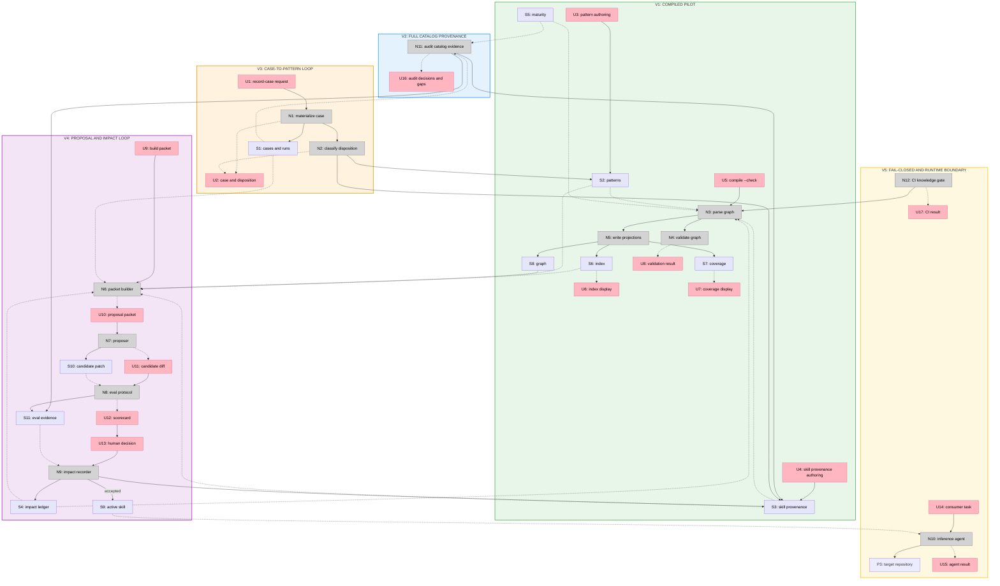

# Compiled Knowledge Layer Slices

Selected shape: C, compiled knowledge graph with human-readable pages.

## Slice summary

| ID | Slice | Mechanisms | Observable demo |
|---|---|---|---|
| V1 | Compiled pilot | C1, C2.1-C2.3, C6.1 | Compile one evidence-rich skill and one gap-only skill, open the generated index and coverage report, then prove a broken relationship fails validation |
| V2 | Full catalog provenance | C1.2, C2, C6.2 | Open one audit table covering all 19 registered skills, with every match classified and every missing application shown as a gap |
| V3 | Case-to-pattern loop | C3 | Record a real case, link or create its pattern, regenerate projections, and show that no installable skill changed |
| V4 | Proposal and impact loop | C4 | Build one bounded proposal packet, evaluate one atomic candidate, reject it, and retrieve the preserved rejection while the active skill remains unchanged |
| V5 | Fail-closed governance and runtime boundary | C2.4, C5, C6.3 | Show CI rejecting unsupported maturity and an installed agent completing a task while the Foundry knowledge directory is unavailable |

## V1: Compiled pilot

### Outcome

The knowledge model works end to end on `review-gate` as an evidence-rich skill and `before-after` as a gap-only skill without requiring a full catalog backfill.

### Affordances added

| ID | Place | Component | Affordance | Control | Wires Out | Returns To |
|---|---|---|---|---|---|---|
| U3 | P1.2 | pattern page | Pattern authoring surface | edit | → N3 | |
| U4 | P1.2 | skill provenance page | Skill provenance authoring surface | edit | → N3 | |
| U5 | P1.3 | terminal | `bun scripts/compile-knowledge.mjs --check` | invoke | → N3 | |
| U6 | P1.3 | generated index | Pattern and skill index | display | | |
| U7 | P1.3 | generated coverage | Pilot skill evidence coverage matrix | display | | |
| U8 | P1.3 | terminal | Validation result with exact failing relationship | display | | |
| N3 | P1.3 | knowledge compiler | Parse authored knowledge graph | call | → N4, → N5 | |
| N4 | P1.3 | knowledge validator | Validate relationships, safety, history, and maturity support | call | | → U8 |
| N5 | P1.3 | knowledge compiler | Write deterministic projections | call | → S6, → S7, → S8 | → U6, → U7 |
| S2 | P1.2 | `foundry/knowledge/patterns/*.md` | Initial authored patterns and typed relationships | | | → N3 |
| S3 | P1.2 | `foundry/knowledge/skills/*.md` | Provenance pages for `review-gate` and `before-after` | | | → N3 |
| S5 | P1.3 | `foundry/maturity.json` | Existing maturity claims joined during compilation | | | → N3, → N4 |
| S6 | P1.3 | `foundry/knowledge/index.md` | Generated progressive-disclosure catalog | | | → U6 |
| S7 | P1.3 | `foundry/knowledge/coverage.md` | Generated pilot coverage and gap report | | | → U7 |
| S8 | P1.3 | `foundry/knowledge/graph.json` | Generated machine projection | | | → N4 |

### Demo

Run the compiler, open `index.md` and `coverage.md`, verify that `review-gate` resolves to applied evidence while `before-after` exposes an explicit gap, then temporarily break one evidence path and show the validator fails before restoring it.

### Validation

- Generated projections are byte-stable across two runs.
- `--check` passes on the committed projection and fails when it is stale.
- Duplicate IDs, unknown relationship types, missing paths, and an unsupported public-private boundary fail with exact file context.
- Existing skill validation remains green.

## V2: Full catalog provenance

### Outcome

Every registered skill has one provenance page, and every existing textual match has been read and classified instead of inferred.

### Affordances added

| ID | Place | Component | Affordance | Control | Wires Out | Returns To |
|---|---|---|---|---|---|---|
| U16 | P1.2 | catalog audit | Per-skill applied-evidence decisions and gaps | display | | |
| N11 | P1.2 | catalog audit workflow | Classify every skill-name match by reading its source | call | → S3, → S11 | → U16 |
| S3 | P1.2 | `foundry/knowledge/skills/*.md` | Provenance pages expanded from 2 to all 19 registered skills | | | → N3, → N6 |
| S11 | P1.4 | catalog audit decision record | Durable classification of applied, mentioned, planned, contradicted, or unrelated matches | | | → U16 |

### Demo

Open the audit decision table and generated coverage report. For any registered skill, follow one typed relationship to its source or see an explicit gap. Show that incidental name matches do not count as applications.

### Validation

- Exactly one provenance page exists for every maturity entry and active skill directory.
- Every evidence relationship resolves and declares its type.
- Every `dogfooded`, `evaluated`, or `validated` skill either has applied evidence or a visible mismatch awaiting correction.
- No maturity value changes automatically in this slice.

## V3: Case-to-pattern loop

### Outcome

A newly recorded case can reinforce an existing pattern, create a candidate pattern, expose a coverage gap, or produce no compiled change without directly editing a skill.

### Affordances added

| ID | Place | Component | Affordance | Control | Wires Out | Returns To |
|---|---|---|---|---|---|---|
| U1 | P1.1 | record-a-case | Record-case request | invoke | → N1 | |
| U2 | P1.1 | case artifact | Case with knowledge disposition | display | | |
| N1 | P1.1 | record-a-case | Materialize evidence ledger | call | → S1, → N2 | → U2 |
| N2 | P1.2 | knowledge maintainer protocol | Classify knowledge disposition | call | → S2, → S3 | → U2 |
| S1 | P1.1 | `cases/` and `foundry/runs/` | Case schema extended with one explicit knowledge disposition and typed target | | | → N2, → N6, → N8 |
| S2 | P1.2 | `foundry/knowledge/patterns/*.md` | New evidence appended to an existing or candidate pattern | | | → N3, → N6 |
| S3 | P1.2 | `foundry/knowledge/skills/*.md` | Skill provenance updated only when the new case supports a typed relationship | | | → N3, → N6 |

### Demo

Run `record-a-case` on one real work item, select a knowledge disposition, validate the case and knowledge graph, and show the regenerated index. Confirm `git diff -- skills/` is empty.

### Validation

- The case validator requires exactly one allowed knowledge disposition.
- `link-existing` requires a valid pattern ID.
- `create-candidate` creates a non-promoted pattern with source evidence.
- `gap` and `no-change` remain valid durable outcomes.
- No case operation gains mutation authority over installed skills.

## V4: Proposal and impact loop

### Outcome

A maintainer can derive one atomic skill proposal from compiled knowledge, evaluate it through the existing protocol, and preserve the outcome even when rejected.

### Affordances added

| ID | Place | Component | Affordance | Control | Wires Out | Returns To |
|---|---|---|---|---|---|---|
| U9 | P1.4 | terminal | Build packet for one skill | invoke | → N6 | |
| U10 | P1.4 | proposal packet | Bounded patterns, history, outcomes, and evidence | display | → N7 | |
| U11 | P1.4 | candidate diff | Atomic skill patch or no-action result | display | → N8 | |
| U12 | P1.4 | eval scorecard | No-skill, released, candidate, trigger, and transfer results | display | → U13 | |
| U13 | P1.4 | human gate | Accept, reject, absorb, or retain no change | decide | → N9 | |
| N6 | P1.4 | proposal packet builder | Select one skill's relevant compiled context | call | | → U10 |
| N7 | P1.4 | skill proposer | Produce one skill patch or no-action result | call | → S10 | → U11 |
| N8 | P1.4 | existing eval protocol | Run behavioral variants and transfer holdout | call | → S11 | → U12 |
| N9 | P1.4 | impact recorder | Append decision and update accepted provenance | call | → S4, → S3, → S9 | |
| S4 | P1.4 | `foundry/knowledge/impact.jsonl` | Append-only proposal identity, sources, metrics, decision, and supersession | | | → N3, → N6 |
| S9 | P1.4 | `skills/**/SKILL.md` | Active skill changes only after an accepted human decision | | | → N10 |
| S10 | P1.4 | Candidate skill workspace | Reversible atomic patch under evaluation | | | → N8 |
| S11 | P1.4 | Skill eval and round evidence | Observable candidate outcomes and human-reviewed decision inputs | | | → N9, → U12 |

### Demo

Build a packet for one skill, propose one patch, run the existing variant matrix, reject the candidate, then query the impact history. The rejection and diff identity remain visible while the active `SKILL.md` is byte-identical to its pre-proposal state.

### Validation

- One impact record targets exactly one skill and references at least one pattern or explicit no-action reason.
- Proposal IDs and diff identities are unique.
- Rejected candidates cannot change the active skill tree.
- Accepted candidates require eval evidence and a human decision handle.
- Transfer metadata records source and inference model or agent when available.

## V5: Fail-closed governance and runtime boundary

### Outcome

Knowledge provenance becomes an enforced catalog invariant, while installed execution remains independent from the Foundry memory.

### Affordances added

| ID | Place | Component | Affordance | Control | Wires Out | Returns To |
|---|---|---|---|---|---|---|
| U14 | P2 | agent interface | Consumer engineering task | invoke | → N10 | |
| U15 | P2 | agent interface | Agent result and evidence | display | | |
| U17 | P1.3 | CI | Fail-closed catalog provenance result | display | | |
| N10 | P2 | inference agent | Execute task with active installed skill only | call | → P3 | → U15 |
| N12 | P1.3 | existing CI workflow | Invoke knowledge validation with the catalog validators | call | → N3 | → U17 |
| S9 | P1.4 | `skills/**/SKILL.md` | Only active promoted procedure enters distribution | | | → N10 |

### Demo

Set a test fixture to `dogfooded` without applied evidence and show CI fail closed. Restore it, install one skill into a temporary agent directory without `foundry/`, run a representative task, and show the agent completes using only promoted procedure.

### Validation

- `validate-skills.mjs` invokes knowledge validation.
- CI rejects unsupported maturity, missing provenance pages, broken evidence links, and stale projections.
- Installer output contains active skill files and promoted references only.
- A real installed-skill run succeeds with no `foundry/knowledge/` path available.
- README, governance, source-of-truth, Foundry overview, and website projection agree on the new boundary.

## Sliced breadboard

## Slice grid

|  |  |  |
|:---|:---|:---|
| **V1: COMPILED PILOT** ✅ COMPLETE  • Pattern and provenance schema • Compiler, validator, projections • `review-gate` rich evidence • `before-after` explicit gap  *Demo: compile and break one relationship* | **V2: FULL CATALOG PROVENANCE** ✅ COMPLETE  • 19/19 provenance pages • 279 textual matches classified • Unsupported gaps preserved • Match fingerprints enforced  *Demo: inspect any skill from one coverage report* | **V3: CASE-TO-PATTERN LOOP** ✅ COMPLETE  • Schema 2 disposition contract • Typed pattern, gap, or no-change target • Real case reinforces an existing pattern • Dogfood commit leaves `skills/` unchanged  *Demo: validate the case and regenerate the index* |
| **V4: PROPOSAL AND IMPACT LOOP** ⏳ PENDING  • Build bounded packet • Propose one atomic patch • Run existing eval protocol • Preserve rejection history  *Demo: reject a patch without losing its lesson* | **V5: FAIL-CLOSED AND RUNTIME BOUNDARY** ⏳ PENDING  • Join provenance to maturity • Add CI enforcement • Verify installed package boundary • Synchronize public docs  *Demo: unsupported maturity fails, installed execution works* |  |
