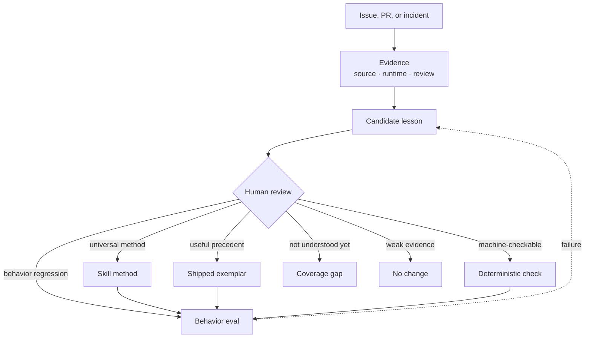

# Skill governance

Railly Skills is adopting a promotion system for methods grounded in real maintenance work and behavior evaluation. The initial catalog predates this system and must earn maturity retroactively. A lesson is not a skill merely because it worked once.

## Evidence pipeline

## Skill maturity

| State | Required evidence |
|---|---|
| Experimental | A coherent method and trigger boundary exist |
| Dogfooded | The method was used on real work and the resulting cases are recorded |
| Evaluated | A baseline comparison exists, even if the result is inconclusive |
| Validated | Repeated trials show a positive effect across holdouts, with human review |
| Deprecated | Evidence or overlap shows the skill should no longer be recommended |

The machine-readable registry is [maturity.json](maturity.json). No existing skill is validated by default.

## Candidate decision states

These states describe a proposed change moving through the foundry, not whether a public case may be recorded.

| State | Meaning | May enter agent runtime |
|---|---|:---:|
| Observed | A real case exists, but no transferable lesson is proven | No |
| Candidate | A bounded method or rule has been extracted | No |
| Evaluated | It beats the baseline and current version on required evals | No |
| Reviewed | Provenance, confidentiality, overlap, and portability were checked | No |
| Promoted | The method is merged into the agent runtime surface | Yes |
| Deprecated | Evidence shows the method is harmful, redundant, or obsolete | No, except migration notice |

## Independent status dimensions

Never infer technical validation from review or merge status. Record these dimensions separately.

| Dimension | Example values | Answers |
|---|---|---|
| Technical validation | unvalidated, contributor-validated, independently validated | How directly was the claim exercised and by whom? |
| Human review | pending, contributor-complete, independent-complete | Who critically checked the case and its evidence? |
| Maintainer acceptance | pending, changes-requested, approved | Has the upstream owner accepted the approach? |
| Delivery | local, PR open, merged, released, artifact verified | How far did the change actually travel? |

A contributor-validated open PR is valid evidence of the contributor's method. It is not evidence of upstream endorsement or shipping. A merged PR is not automatically proof that its regression test was falsified or its final artifact verified.

## Required evals

Evals judge agent behavior and evidence, not prose similarity.

| Eval | Question | Passing signal |
|---|---|---|
| Trigger | Does the right skill load? | Correct invocation on positive cases |
| Negative trigger | Does it stay out of unrelated work? | No invocation on near misses |
| Method | Does the agent follow the gates in order? | Required states and handoffs are observed |
| Outcome | Did the method produce the claimed evidence? | A real repro, artifact, trace, or test exists |
| Transfer | Does it work outside the originating repository? | Passes on a different stack or codebase |
| Regression | Is it better than what is already published? | Candidate beats no-skill and current-skill baselines |

## Promotion checklist

- The source case is real and its evidence is retrievable.
- The lesson is phrased without employer, repository, stack, editor, or agent assumptions.
- Confidential information stays in an approved system.
- The candidate has a single owner and does not duplicate another skill.
- Trigger and near-miss evals pass.
- Method and outcome evals pass.
- At least one transfer holdout passes.
- The candidate improves on the current release, not only the no-skill baseline.
- A human approves promotion.

## Governance rule

Promote the smallest durable change supported by the evidence. That may be an exemplar, one reference rule, a deterministic check, an eval, or no change. Creating a new skill is the most expensive outcome, not the default one.
