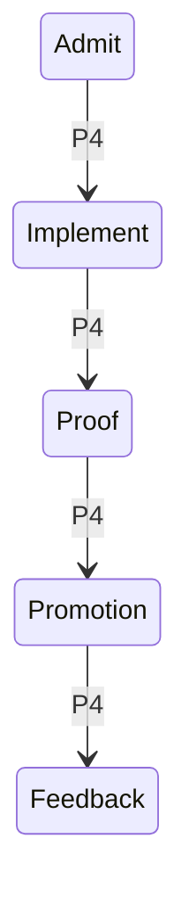

# Solution gate run: Pocket Factory lifecycle UI contract

Date: 2026-08-15
Repository: `/Users/raillyhugo/Programming/railly/pocket-software-factory`
Trigger: the correction changes a shared presentation contract, and the defect admits a local restyle, a lifecycle-model change, or a graft.
Mode: greenfield fix.

Runtimes:

| Role | Runtime |
|---|---|
| Proposer A | OpenAI GPT-5.5 adversarial reviewer |
| Proposer B | Alibaba Qwen 3.5 Plus through OpenCode |
| Synthesizer and implementer | OpenAI GPT-5.6-Sol |

Claude Fable 5 was attempted first for proposer B and rejected as unavailable after the CLI reported its weekly limit. Gemini CLI was also rejected before proposal generation because the configured account required `GOOGLE_CLOUD_PROJECT`. Neither failed attempt contributed a proposal.

## Contract

Property: Every user-visible state from starting a factory run through evidence review, feedback, human judgment, and promotion must present one coherent and truthful lifecycle contract.

Observable: Simulator captures for proof-stage and feedback-stage runs must show the exact lifecycle state without regression to Solution. Proof and Decision Gate must share the FactoryDesign hierarchy, spacing, canvas, semantic colors, Markdown rendering, target sizes, and explicit loading/error/empty states in light and dark.

Must not change:

- Gateway or API payloads.
- Exact SHA and evidence binding.
- DeviceCheck and device-owner authentication.
- Approve, send-back, and reject semantics.
- Markdown content.
- GitHub source and repository selection.
- Worker and harness selection.
- Navigation.
- Running, cancellation, retry, and promotion behavior.

Grounding read before proposals:

- `PocketFactory/Views/FactoryDesign.swift:86-104`: six compact stages and unknown-stage fallback to index zero.
- `PocketFactory/Views/CaseView.swift:159-213`: formula nodes and lifecycle rendering.
- `PocketFactory/Views/CaseView.swift:381-432`: ProofView uses stock List.
- `PocketFactory/Views/CaseView.swift:456-505`: GateView uses stock Form.
- `PocketFactory/Views/CaseView.swift:12-29`: parent lifecycle uses a continuous FactoryDesign canvas.

## Proposal A, verbatim

### Shape

Make `FactoryLifecycle` the single Swift presentation contract for lifecycle truth, without changing gateway payloads or ledger semantics.

The shape is:

1. Replace the six-label compact contract in `FactoryDesign.swift` with a canonical descriptor table that covers every user-visible stage the app already receives or renders: `Admit`, `Solution`, `Execute`, `Checks`, `Review`, `Resilience`, `Proof`, `Feedback`, `Human`, `Promotion`, plus terminal/auxiliary descriptors for `Cancelling`, `Cancelled`, and unknown raw stages.
2. Keep `WorkItemProjection.stage` as the raw API/ledger field. Presentation resolves it through `FactoryLifecycle.StageDescriptor`, with aliases: `admit -> Admit`, `solution/shaping -> Solution`, `implement/implementation/code -> Execute`, `checks -> Checks`, `review/review-gate -> Review`, `resilience/resilience-audit -> Resilience`, `proof -> Proof`, `feedback -> Feedback`, `human/decision/gate -> Human`, `promotion/pull-request/ready/completed -> Promotion`, `cancelling -> Cancelling`, `cancelled -> Cancelled`.
3. Delete the dangerous default-to-Solution behavior. Unknown stages should display a title-cased raw label and should not mark the rail as stage zero. If ordering cannot be known, render the unknown current stage as an inserted current marker rather than pretending it is Solution.
4. Make `FactoryLifecycleRail` consume descriptors, not hard-coded strings. It should render the full visible lifecycle compactly, using existing semantic colors from `FactoryDesign`. When a `FormulaRecord` is present, the formula checklist remains the source for node statuses and labels, but the rail still resolves the current raw stage through the same descriptor table.
5. Update `fallbackNodes` to use the same descriptor table, so fallback formula, rail label, accessibility label, home card stage text, and case header cannot diverge.
6. Replace `ProofView` List and `GateView` Form with the same `ScrollView -> VStack -> pagePadding -> FactoryDesign.canvas -> factoryCard/FactorySection` hierarchy used by `CaseView`. Keep existing Markdown content rendered through `FactoryMarkdownView`, keep exact SHA/evidence fields, keep the existing approve/send-back/reject calls and authentication path intact.
7. Add small local Swift view-load states for proof, formula, and feedback: `loading`, `loaded-empty`, `loaded`, `failed`. This is only presentation state. It does not change `FactoryAPI`, gateway routes, or payload schemas. The current model collapses proof failure to nil and feedback failure to empty, which cannot satisfy explicit loading/error/empty UI parity.

### Predictions

1. Stage mapping unit tests will fail before this shape and pass after it:
   `xcodebuild test -project PocketFactory.xcodeproj -scheme PocketFactory -destination 'platform=iOS Simulator,name=iPhone 17 Pro,OS=26.5' -derivedDataPath .deriveddata CODE_SIGNING_ALLOWED=NO`
   Measurements: `FactoryLifecycle.stageName("feedback") == "Feedback"`, `checks == Checks`, `human == Human`, and an unknown raw stage titleizes instead of returning Solution.
2. Existing backend lifecycle and feedback semantics remain unchanged:
   `bun test gateway/test/formula.test.ts gateway/test/feedback.test.ts`
3. Simulator captures for proof and feedback show no regression to Solution.
4. `rg -n "List \\{|Form \\{" PocketFactory/Views/CaseView.swift` returns no match inside ProofView or GateView while Markdown, exact bindings, and decision submission remain.

### Cost

Adds a lifecycle descriptor abstraction, focused Swift tests, and more layout work. Proof and Gate lose automatic grouped-list spacing. View-local load states add presentation state future screens must keep consistent.

### What it makes worse

The rail becomes denser if every state is made linear. Unknown-stage titleization can expose internal stage names. Removing List and Form loses automatic grouped-list and keyboard behavior around rationale.

### Rejected alternatives

- Only add feedback to the existing switch: checks, human, unknown stages, accessibility labels, and fallback nodes can still lie.
- Change gateway payloads: violates the boundary and is unnecessary.
- Remove the compact rail: other views still need a compact lifecycle contract.
- Keep List and Form and only change the background: does not produce shared hierarchy, spacing, or states.

## Proposal B, verbatim

### Shape

`FactoryLifecycle.steps` becomes the canonical stage list, extended from six to nine stages: `Solution`, `Code`, `Review`, `Resilience`, `Proof`, `Human`, `Feedback`, `Promotion`, `Completed`. The index function maps incoming aliases to these indices. Proof and Decision screens inherit the same rail and canvas, and Feedback becomes a first-class linear stage.

### Predictions

1. New stage tests assert that proof remains index four and feedback becomes index six.
2. New snapshot tests compare Proof and Gate rail spacing and semantic colors against the parent lifecycle card.

### Cost

Three to five hours to extend the list, mapping, tests, snapshots, and thread the rail into Proof and Gate. Ongoing cost is one switch entry per new backend stage.

### What it makes worse

Operators see more stages. Proof and Gate gain 60 to 80 points of vertical weight, pushing the first content section lower on small screens.

### Rejected alternatives

- Keep six stages and map everything else to Solution.
- Add the rail only to Proof.
- Create a separate feedback lifecycle.
- Normalize the UI taxonomy in the backend.

## Forward chains

### Proposal A

Canonical descriptor from observed raw stages `[observed, P1]`
→ every compact stage label uses one resolver `[inferred]`
→ unknown stages stop inheriting Solution `[inferred]`
→ diagnostic internal names may become visible `[guessed]`.

Custom Proof and Gate hierarchy `[observed, P2]`
→ stock grouped surfaces disappear `[inferred]`
→ FactoryDesign owns hierarchy and spacing `[inferred]`
→ automatic Form keyboard behavior is lost `[observed]`
→ sticky actions and keyboard dismissal must be verified manually `[guessed]`.

Harmful branch: treating every descriptor as one linear rail `[inferred]`
→ feedback receives a fixed position `[guessed]`
→ the rail lies when feedback arrives after promotion `[observed, P4]`.

### Proposal B

Nine linear stages `[inferred]`
→ feedback receives a stable index `[inferred]`
→ the visual sequence assumes feedback occurs before promotion `[inferred]`
→ live feedback after promotion contradicts the sequence `[observed, P4]`.

Add a rail to stock Proof and Gate `[inferred]`
→ continuity becomes visible `[inferred]`
→ 60 to 80 points of vertical weight is added `[guessed]`
→ List and Form still remain a second visual grammar `[observed, P2]`.

Harmful branch: snapshot predictions name test targets and an iPhone 16 destination that do not exist in this repository or installed simulator set `[observed, P6]`
→ the advertised verification cannot run `[inferred]`.

## Probe log

| ID | Command or measurement | Result |
|---|---|---|
| P1 | Authenticated `GET /ledger?after=0`, group `payload.stage` | Live stages: admit 8, feedback 3, implement 11, promotion 3, proof 19, review 1, solution 6. |
| P2 | `rg -n '^[[:space:]]*(List|Form) \\{' PocketFactory/Views/CaseView.swift` | List at 382 and Form at 457. |
| P3 | Read `FactoryDesign.swift:86-105` | Unknown raw stages return index zero and display Solution. |
| P4 | Authenticated event sequence for `WI-20260814-817c16` | admit → implement → proof → promotion → feedback. Feedback is a loop after promotion, not a fixed pre-promotion stage. |
| P5 | `bun test gateway/test/formula.test.ts gateway/test/feedback.test.ts` | 4 pass, 0 fail, 12 expectations. |
| P6 | `xcrun simctl list devices available` and `rg --files PocketFactoryTests` | iPhone 17 Pro is installed; no snapshot test target exists. Proposal B predictions are unprobeable as written. |

Prediction disposition:

- A1 survived P1 and P3 and remains an implementation target.
- A2 survived P5.
- A3 remains to be verified after implementation with fresh screenshots.
- A4 survived P2 and remains an implementation target.
- B1 was partly refuted by P4 because feedback is not linear.
- B2 was unprobeable as written because the named target and device do not exist; its visual intent remains useful.

## Failure-shape scoring

| Shape | Proposal A | Proposal B |
|---|---|---|
| S1 over-reach | Hit if every auxiliary state is forced into a new linear rail. Designed out by keeping the six-step primary rail. | Hit: adds Completed and a linear Feedback position not supported by the live contract. |
| S2 under-reach | No hit after unknown fallback and observed aliases are included. | Hit: misses Admit and Checks and retains a fallback-to-zero behavior. |
| S3 direction inheritance | Partial hit if feedback is treated only as forward progress. Designed out as an auxiliary loop. | Hit: feedback is modelled in one direction before promotion despite P4. |
| S4 proxy property | No hit: stage truth and visual parity are separate acceptance checks. | Hit: adding a rail does not remove the stock List/Form grammar. |
| S5 unregistered peer | No persistent or cross-process state added. | No persistent or cross-process state added. |
| S6 peer-version blindness | Unknown-stage fallback explicitly handles future raw values. | Hit: future raw values still map to zero. |
| S7 wrong layer | Shared presentation resolver reaches every Swift consumer. | Partial hit: parent rail changes but stock subview hierarchy remains. |
| S8 guard-derived cells | Tests include observed aliases and an unknown raw value. | Hit: proposed cells mirror only proof and feedback. |
| S9 test pins wrong thing | Unit mapping plus rendered screenshots cover mechanism and result. | Hit: snapshot commands target infrastructure that does not exist. |
| S10 claim from prose | Raw stage domain came from the live ledger and gateway formula. | Hit: linear feedback order came from proposal structure, not execution. |
| S11 asymmetric validation | One resolver closes divergence across consumers. | Partial hit: aliases remain a growing switch and not every consumer is named. |
| S12 primitive mismatch | Custom hierarchy matches the continuous-canvas contract while preserving native controls. | Hit: stock List/Form remain and only receive another rail. |

## Synthesis

Kind: graft.

Take from proposal A:

- One presentation resolver for raw stage names.
- Unknown stages never default to Solution.
- Proof and Decision Gate move from List/Form to the continuous FactoryDesign hierarchy.
- Exact Markdown, binding, authentication, and decision semantics remain untouched.
- View-local loading and unavailable states.

Take from proposal B:

- Preserve visible lifecycle continuity inside Proof and Decision Gate.

Change both proposals at the seam exposed by P4:

- Keep the existing six-step compact rail as the primary path: Solution, Code, Review, Resilience, Proof, Pull request.
- Treat Feedback, Cancelling, Cancelled, and unknown raw stages as auxiliary states with exact labels, not new linear rail positions.
- The backend formula remains the detailed nine-node truth: Admit, Solution, Execute, Checks, Review, Resilience, Proof, Human, Promotion.
- For feedback, the compact rail preserves prior progress and labels the current auxiliary state as Feedback. It does not invent a pre-promotion position.

Losing material accounted for:

- Rejected proposal A full linear descriptor rail because P4 refuted it for feedback.
- Rejected proposal B nine-step rail and stock container retention because they repeat S1, S2, S4, S9, S10, and S12.
- Rejected API changes because the raw data is already sufficient.

Carried assumptions:

- The six-step primary rail remains legible under large Dynamic Type.
- A custom rationale field plus sticky action bar preserves keyboard and safe-area behavior previously supplied by Form.
- Proof and Gate can expose lifecycle continuity without duplicating the detailed formula checklist.
- Unknown-stage titleization is preferable to a false known stage.

## Smallest auditable visuals

Observed evidence, P4:



Proposed shape:

```text
raw WorkItemProjection.stage [observed, P1]
└── FactoryLifecycle.presentation(raw) [inferred]
    ├── primary rail index or auxiliary state [inferred]
    ├── exact stage label [inferred]
    ├── accessibility label [inferred]
    └── Proof / Decision context [inferred]

FormulaRecord.nodes [observed, gateway formula]
└── detailed nine-node checklist [observed]

ProofView / GateView
└── ScrollView → FactoryPageTitle → FactorySection → native controls [inferred]
```

The evidence visual and proposal visual remain separate. Mermaid is used only for the observed event order; a text tree is the smallest view for ownership.

## Implementation handoff

Verification predicates:

1. `FactoryLifecycle.stageName("feedback") == "Feedback"` and an unknown stage never returns Solution.
2. The feedback case `WI-20260814-817c16` renders Feedback while preserving its post-promotion context.
3. ProofView and GateView contain no stock List/Form root.
4. Markdown, exact SHA, evidence digest, authentication, and three decision actions remain.
5. Focused backend formula and feedback tests remain green.
6. Swift tests, light mode, dark mode, long content, accessibility tree, simulator, and physical iPhone are driven after implementation.

`trail-decisions` could not be loaded from the advertised installation or canonical skills checkout, so the carried assumptions remain recorded here instead of being silently dropped.

## Implementation audit

Status: accepted after correction.

- The live feedback case now exposes `Factory lifecycle, current stage Feedback` and keeps the compact rail at the Pull request loop position.
- Proof and Decision Gate use the shared continuous canvas, render Markdown, and expose the exact result SHA, evidence digest, remaining risk, and authenticated actions.
- The first accessibility-extra-extra-extra-large pass exposed clipped fixed-height actions. The action bar now uses flexible height and stacks Send back and Reject vertically at accessibility sizes.
- The Runs accessibility label now uses the shared exact stage resolver, including Feedback, Code, Human, and future unknown raw stages.
- Backend: 51 tests passed, 0 failed, 142 expectations.
- Swift: 11 tests passed, 0 failed.
- Simulator: repository loading, inherited repository selection, live Codex catalog, Solution Gate CTA enablement, dark, light, long proof content, feedback, enabled and disabled decision actions, and accessibility-extra-extra-extra-large were exercised. No new factory run was submitted during the UI audit.
- Physical iPhone 15 Plus: the signed app built, installed, launched, and the process was confirmed running.
- Gateway health returned `{"ok":true,"latestSequence":51}`.

Accepted evidence:

- `pocket-software-factory/Evidence/lifecycle-audit-after/01-feedback-after-dark.png`
- `pocket-software-factory/Evidence/lifecycle-audit-after/02-proof-after-dark.png`
- `pocket-software-factory/Evidence/lifecycle-audit-after/03-decision-after-dark.png`
- `pocket-software-factory/Evidence/lifecycle-audit-after/04-decision-after-light.png`
- `pocket-software-factory/Evidence/lifecycle-audit-after/05-decision-axxxl-light.png`
