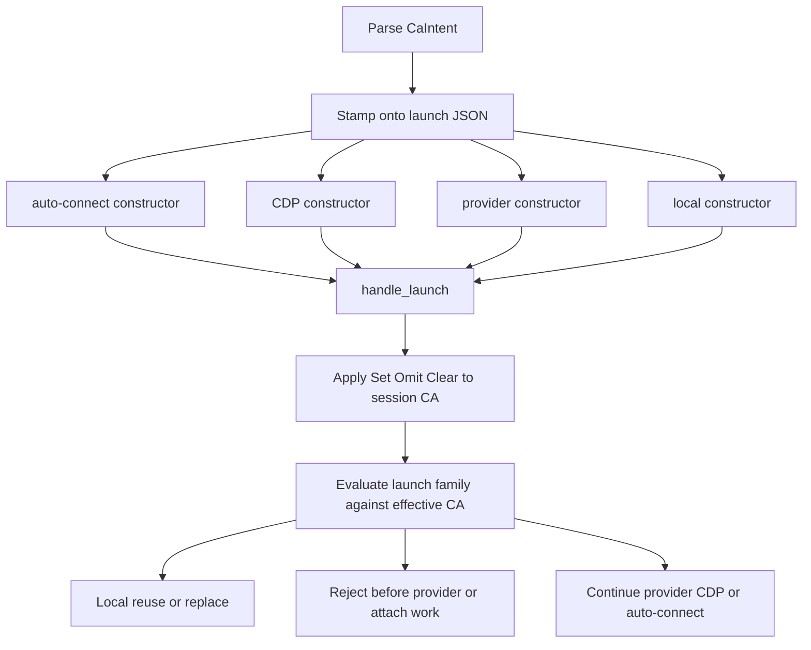

# Grok 4.6 blind shaping artifact

Model: `cursor-grok-4.6-xhigh`

Transcript SHA-256: `903bdeca9ea4cb0b7f3d831025a36a87ff50660ebba20e9ef8ebe84565aabf69`

The content below is the model's `CreatePlan` artifact verbatim.

---

# Shaping: selective CA trust installers and launch transitions

Blind pass from the frozen packet and detached base `548b159b30eef119ccf6846c8bc807d0eaa3f6f8` only. No candidate, PR, or prior shaping output was used.

## Frame

A first-party `agent-browser` install cannot currently make selective private-CA trust work after clean Linux/Eve setup, and an explicit clear can be lost before it reaches a long-lived session. Desired: after first-party setup, Set works; Omit retains; Clear removes. Every independently built launch path preserves that contract or rejects before partial work.

Base facts that load-bear:

- First-party dep maps install NSS **runtime** (`libnss3` / `nss`) and do not install a tools package. Maps are duplicated: [`cli/src/install.rs`](cli/src/install.rs) (apt/dnf/yum), [`packages/@agent-browser/eve/extension/lib/sandbox.ts`](packages/@agent-browser/eve/extension/lib/sandbox.ts) (apt/dnf, no yum), [`packages/@agent-browser/sandbox/src/vercel.ts`](packages/@agent-browser/sandbox/src/vercel.ts) (dnf), plus copies in [`examples/environments/lib/agent-browser-sandbox.ts`](examples/environments/lib/agent-browser-sandbox.ts) and [`benchmarks/bench.ts`](benchmarks/bench.ts).
- Launch JSON is built four times in [`cli/src/main.rs`](cli/src/main.rs): auto-connect, CDP, provider, local. Provider is the sparsest (no `ignoreHTTPSErrors`, no `pinTab`). Local send is gated by `should_send_local_launch_config`, which is false whenever provider/CDP/auto-connect is set, and also false for a bare later command with no other launch flags.
- Daemon `handle_launch` in [`cli/src/native/actions.rs`](cli/src/native/actions.rs) treats **absent** fields as sticky fallback (headed, allowedDomains, hideScrollbars). That is the omit semantics. A dropped Clear becomes Omit.
- MCP delegates through CLI argv ([`cli/src/mcp.rs`](cli/src/mcp.rs)). Several helpers drop empty strings (`if !value.is_empty()`). Eve `installIfMissing` only probes `command -v` of the binary; template refresh depends on `EVE_BOOTSTRAP_REVISION` inside `agentBrowserRevalidationKey`.

## 1. Complete R table

Settled rows are unchanged from the packet. Derived rows are labeled. One syntax row is undecided.

- **R0** (settled, core goal): A first-party-supported local Chromium session on Linux can trust certificates issued by one user-supplied private CA without disabling ordinary certificate verification.
- **R1** (settled, must-have): After first-party dependency setup on each supported Linux package family (CLI apt, dnf, yum) and in the default Eve sandbox, selective CA trust works without a second manual package-install step.
- **R2** (settled, must-have): Every production external executable introduced by the feature is mapped to the package that provides it in every first-party installer and sandbox bootstrap that owns the feature.
- **R3** (settled, must-have): A missing or failing prerequisite produces an actionable error before Chromium launches and leaves no created trust or browser state behind.
- **R4** (settled, must-not-change): Without CA configuration, existing installation and launch behavior remains unchanged. Prerequisite checks must not run on the unset path.
- **R5** (settled, must-have): In a continuing named session, omission preserves the prior effective CA. Explicit clear removes it. Set, omit, and clear remain distinct through every independently constructed launch envelope.
- **R6** (settled, must-have): After local CA trust is set, `provider + explicit clear` removes local-only state **before** provider compatibility is evaluated, so the provider launch is not rejected for stale CA state.
- **R7** (settled, must-have): After local CA trust is set, `provider + omitted CA input` retains the effective CA and is rejected clearly before provider work begins.
- **R8** (settled, must-have): A provider request that tries to set local-only CA trust is rejected clearly before provider work begins.
- **R9** (settled, must-have): Local, provider, CDP, auto-connect, MCP, config, environment, and Eve paths express one consistent set/omit/clear contract or reject unsupported transitions before partial work.
- **R10** (settled, must-have): Repeating the same effective CA reuses the live local browser. Changing or explicitly clearing it replaces only the browser as declared, without collapsing omission into removal.
- **R11** (settled, must-have): Tests derive transition cells from the external state domain and all independent envelope constructors, not from only the implementation branch changed by the fix.
- **R12** (settled, must-not-change): The CLI's own outbound TLS trust remains outside the change.
- **R13** (settled, must-have): Useful candidate work and contributor attribution are preserved when compatible with the selected contract.
- **R14** (derived, must-have): Every shipped first-party Chromium system-dep map that this repo uses to bootstrap a browser (CLI apt/dnf/yum, Eve apt/dnf, Vercel sandbox dnf, and the in-repo duplicates in examples and benchmarks) includes the same feature-executable mapping. Inventory from U1 on this base.
- **R15** (derived, must-have): Set and Clear always produce a daemon-visible command. They must not depend on coincidental `should_send_local_launch_config` triggers. Clear on a later `snapshot` with no other launch flags must still arrive.
- **R16** (derived, must-have): Tests fail if (a) a runtime prerequisite check remains after its package mapping is removed, or (b) any independent wrapper/constructor drops explicit Clear. Matches the packet discriminators.
- **R17** (derived, must-have): Changing Eve's sandbox package map bumps `EVE_BOOTSTRAP_REVISION` (and any Vercel snapshot guidance) so default template revalidation actually reinstalls deps. Tool-time `installIfMissing` does not.
- **R18** (derived, must-have): Clear must be a token that existing parsers cannot drop or treat as omit (empty string, missing JSON key, falsey, `env::var` filtered empty). MCP and optional-string helpers already drop `""`.
- **R19** (undecided): Exact user-facing Clear syntax (dedicated flag vs non-empty sentinel vs JSON `null`) is a representation choice, not a new behavioral requirement. S2 recommends a dedicated non-empty token.

Packet U1–U5 after this base read:

- **U1** resolved enough: owned setup paths are the maps listed under R14. Eve has no yum path today; that is a pre-existing Eve limit, not a new CA hole.
- **U2** partly resolved: the case handle names `certutil`; base maps ship NSS runtime only. Exact distro package names still need the cheap spike (tools package, not `libnss3`/`nss`).
- **U3** open as R19; mechanism constraint is R18.
- **U4** resolved as policy: structural coupling **and** exhaustive tests. F9 shows tests of a single branch are not enough; a fifth constructor can still appear.
- **U5** resolved by the packet temporal matrix; keep it as the daemon's apply-then-dispatch table.

## 2. Materially distinct shapes

### S1 HolePatch (rejected)

**Mechanism**

- Add the distro tools package to the two maps named by F2/F3 (CLI apt + CLI dnf/Eve dnf).
- Attach the CA field on the provider constructor only (the F8 hole).
- Keep existing isolated clear/provider tests.

**Unknowns:** U2 package names; CDP/auto-connect/local-gated send; MCP empty-string drop; Vercel/yum/examples maps; daemon apply order if not also changed.

**Why distinct:** minimal observed-bug edits, no shared serializer, no full inventory.

### S2 Canonical CaIntent stamp + mapped prerequisites (survivor)

**Mechanism parts**

1. **CaIntent** in parsed flags: `Omit | Set(path) | Clear`. Same type from CLI, config, env, MCP argv. Config/env use the same three-way encoding.
2. **One stamp function** `attach_ca_intent(&mut launch_cmd, intent)`:
   - Omit: field absent
   - Set: string path
   - Clear: explicit non-droppable JSON value (not `""`, not missing)
3. **Every constructor calls it:** auto-connect, CDP, provider, local in [`cli/src/main.rs`](cli/src/main.rs). MCP adds a first-class schema field (and `extraArgs` still works) that maps to the same CLI flag; it must not go through helpers that skip empty strings.
4. **Forced send:** `Set` or `Clear` makes a launch command go out even when `should_send_local_launch_config` is false. Provider/CDP/auto-connect already send a launch command; they must stamp CA onto that object, not onto a second local envelope that will never be sent.
5. **Daemon apply-then-dispatch:** `handle_launch` updates effective session CA from the stamped intent **before** provider/CDP/auto-connect compatibility. Then run the packet matrix. CA lives in session/launch state, **not** in `daemon_config_fingerprint` (that hash is debug/policy/idle only today).
6. **Prerequisite mapping:** add the package that provides `certutil` to every R14 map. Runtime `which`/exec check only on **Set**. Failure: actionable error naming the package, no cert DB, no browser (R3). Unset path does not check (R4).
7. **Eve/Vercel:** bump `EVE_BOOTSTRAP_REVISION`; document that existing Vercel snapshots must be rebuilt.
8. **Tests:** table-driven stamp tests over the four constructors; daemon transition table (prior × request × family) without requiring Chrome for reject/retain/clear-order cells; installer tests that the tools package is present in each map and that removing it while a runtime check remains fails; MCP argv test that Clear is emitted; one PATH-absent Set test for R3.
9. **Parity surfaces:** flag, help (`output.rs`), README, schema, core skill/references, docs MDX, MCP, tests. Do not put the contract only in the discovery stub.

**Unknowns:** U2 exact package names (spike); R19 syntax (choose a dedicated flag such as `--ca-cert <path>` plus `--clear-ca-cert`, or a non-empty sentinel like `none`/`clear` that cannot be dropped). F12 is **not** solved here: keep the external executable.

**Why distinct:** one intent object, structural coupling of envelopes, full installer inventory, apply order specified.

### S3 Eliminate `certutil` + stamp (rejected until spike)

**Mechanism:** same CaIntent stamp and apply-then-dispatch as S2, but write NSS DB / Chromium trust material in-process so first-party maps need no tools package.

**Unknowns:** F12 is load-bearing and **unknown**. Hostname, unrelated CA, expiry, and not-yet-valid checks must stay as strong as R0. Portable file format for Chrome for Testing on Debian vs AL2023 is unproven on this evidence.

**Why distinct:** removes the production executable instead of mapping it.

### S4 Out-of-band CA sidecar + mapped prerequisites (rejected)

**Mechanism:** a dedicated session-config command (`ca.set` / `ca.clear`) always sent before launch. Launch JSON never carries CA. Installer mapping as S2.

**Unknowns:** every CLI path must still send the sidecar (same independent-constructor problem, moved); raw daemon clients that only send `action: launch`; extra round-trip; Clear must still force browser replace (R10) via a follow-on launch.

**Why distinct:** CA is not a launch-envelope field.

### S5 Vendored `certutil` + stamp (rejected)

**Mechanism:** S2 stamp, but ship `certutil` (or a static NSS tool) with the Linux CLI instead of distro packages.

**Unknowns:** license/size, PATH vs bundled path, musl vs gnu, whether Chrome's NSS DB matches the bundled tool, Windows/macOS later. R2 mapping becomes "we are the provider."

**Why distinct:** provisioning channel is the binary, not apt/dnf/yum.

Not a shape: docs-only "install the tools package yourself" (forbidden by R1 and F4). Not a shape: CLI-side sticky replay of the last CA path (collapses Omit into Set in the envelope, fights R5).

## 3. Binary R × Shape fit check

Legend: P = pass, F = fail. Failure notes follow.

- **R0** S1 P / S2 P / S3 F / S4 P / S5 P
- **R1** S1 F / S2 P / S3 F / S4 P / S5 P
- **R2** S1 F / S2 P / S3 P / S4 P / S5 P
- **R3** S1 P / S2 P / S3 F / S4 P / S5 P
- **R4** S1 P / S2 P / S3 F / S4 P / S5 P
- **R5** S1 F / S2 P / S3 P / S4 F / S5 P
- **R6** S1 P / S2 P / S3 P / S4 F / S5 P
- **R7** S1 P / S2 P / S3 P / S4 P / S5 P
- **R8** S1 P / S2 P / S3 P / S4 P / S5 P
- **R9** S1 F / S2 P / S3 P / S4 F / S5 P
- **R10** S1 F / S2 P / S3 P / S4 F / S5 P
- **R11** S1 F / S2 P / S3 P / S4 F / S5 P
- **R12** S1 P / S2 P / S3 P / S4 P / S5 P
- **R13** S1 P / S2 P / S3 P / S4 P / S5 P
- **R14** S1 F / S2 P / S3 P / S4 P / S5 P
- **R15** S1 F / S2 P / S3 P / S4 F / S5 P
- **R16** S1 F / S2 P / S3 P / S4 F / S5 P
- **R17** S1 F / S2 P / S3 P / S4 P / S5 P
- **R18** S1 F / S2 P / S3 P / S4 F / S5 P
- **R19** n/a for all (undecided syntax; does not by itself pass or fail a shape)

Failure notes:

- **S1 / R1,R2,R14,R17:** CLI yum, Vercel dnf, examples/benchmarks copies, and Eve revision stay stale. F3-class AL2023 holes remain on non-CLI maps.
- **S1 / R5,R9,R10,R15,R18:** CDP and auto-connect constructors can still omit Clear. Local Clear on a command that does not already trigger `should_send_local_launch_config` never sends. Empty-string Clear still dies in MCP.
- **S1 / R11,R16:** Matches F9: isolated provider/clear tests miss constructor × prior-state cells.
- **S1 / R6:** Marked P only because S1's definition includes the provider attach. If daemon still checks provider compatibility before applying Clear, R6 becomes F even with the field present. That order bug is in scope for S2; S1 does not specify it, so R6 is fragile.
- **S3 / R0,R1,R3,R4:** F until F12 is closed. An in-process DB that is wrong is worse than a missing package. Cannot claim pass on this evidence.
- **S3 / R2:** P vacuously if no production external executable remains. If a library/soname is still required, it must be mapped or this flips to F.
- **S4 / R5,R6,R9,R10,R11,R15,R16,R18:** The sidecar is another independently constructed envelope. Doctor, plugins, and any `action: launch` client that skips the sidecar replay F8. Clear that only updates stored CA without a declared browser replace fails R10.
- **S5:** Passes provisioning Rs if the bundled tool is the one Chrome's NSS DB accepts. Left rejected on unknowns and on carrying a third-party executable in the product tarball when distro packages already work (F2, F3).

## 4. Recommendation

**Survivor: S2.**

It is the only shape that fits every settled must-have on present evidence. F2/F3 already prove a tools package supplies the executable. F8/F9 prove the bug is **constructor × sticky-absent-field**, which is the same pattern as `attach_pin_tab_to_command` (called from auto-connect/CDP, not provider) and `should_send_local_launch_config` (never true alongside provider). Shared stamp plus apply-then-dispatch is the structural fix; the matrix tests are the backstop, not the design.

**Rejected**

- **S1:** will re-ship F8 on the next wrapper (CDP, auto-connect, MCP, local snapshot+clear).
- **S3:** blocked on F12; do not make it the plan.
- **S4:** relocates the drop hazard; does not remove it.
- **S5:** heavier provisioning than F2/F3 require.

**Required spikes (cheap, before or during implementation, not a new shape)**

1. On clean Debian Bookworm and Amazon Linux 2023: which package provides `certutil` (`libnss3-tools` vs `nss-tools` expected; confirm, do not guess in code). Packet already says "platform tools package" works.
2. Pick R19 syntax that satisfies R18. Recommended: dedicated `--clear-ca-cert` (and MCP `clearCaCert: true` / config `caCert: null` only if parsers preserve null). Do not use `""`.
3. F12 remains an **optional** later spike, not a gate. Keep certutil.

**Preserve (R13):** any compatible contributor mapping of tools packages, tri-state flag, or provider attach should be kept and then completed to S2 (all maps, all constructors, apply order, tests). Do not discard a partial hole-patch; extend it.

## 5. Forward effects for S2 (including harmful)

1. **Harmful: empty Clear becomes Omit.** If Clear is `""` or a missing key, MCP `if !value.is_empty()`, optional env, and JSON omit will restore F8: provider launch retains CA and rejects. Mitigation: R18 token; MCP/schema tests.
2. **Harmful: Eve/Vercel already-bootstrapped images.** Adding a package without bumping `EVE_BOOTSTRAP_REVISION` leaves default Eve on the old map. Vercel `snapshotId` skips bootstrap entirely. Mitigation: R17; snapshot rebuild note; R3 error still names the package if Set is attempted on a stale image.
3. **Harmful: prerequisite check on the unset path.** A global `certutil` check at every launch changes non-CA installs (R4) and fails clean images that never use CA. Mitigation: check only on Set.
4. **Harmful: CA in daemon env/fingerprint.** Putting CA into `DaemonOptions` / `daemon_config_fingerprint` would restart the daemon on later omits or fail to clear a live session. Mitigation: session launch state only, like sticky `allowedDomains` fallback, with explicit Clear distinct from absent.
5. **Forward: a fifth launch family.** Any new constructor that copies the provider block and forgets `attach_ca_intent` fails R16 tests. The test must enumerate constructors, not the last bug.
6. **Forward: Lightpanda / profiles / non-Linux.** Set on unsupported families must reject before partial work (packet matrix). Do not install tools packages on macOS/Windows as a substitute for a trust mechanism those platforms do not have yet.

## 6. Cheapest falsifying probes (weakest load-bearing assumptions)

Assumptions ranked, cheapest probe first. None require a candidate checkout.

1. **Stamp drop (F8 mechanism).** Unit: build each of the four launch objects from `CaIntent::Clear` and from `Omit`. Probe fails if any Clear JSON equals Omit (field absent) or uses `""`. Cost: one table test in `main.rs`.
2. **Apply order (R6).** Unit on a pure transition function: prior=Set, request=(Clear, provider) → CA unset and provider allowed; prior=Set, request=(Omit, provider) → CA retained and provider rejected. Probe fails if compatibility runs first. Cost: no Chrome.
3. **Forced send (R15).** Flags with only Clear set: a launch command is produced. Probe fails if `should_send_local_launch_config` stays the only gate.
4. **MCP/parser drop (R18).** `clearCaCert` / sentinel through `append_common_global_args` / `open_args` must appear on argv. Probe fails if Clear is omitted. Cost: existing `mcp.rs` argv tests.
5. **Map invariant (R2/R16).** Assert the tools package string is in CLI apt/dnf/yum lists, Eve apt/dnf, Vercel `CHROMIUM_SYSTEM_DEPS`, and the examples/benchmarks copies. Probe fails if one map is forgotten. Pair with: runtime check symbol exists ⇒ maps must contain the package.
6. **Package name (U2).** On Bookworm and AL2023, `command -v certutil` after first-party deps without the tools package is false; after installing the tools package it is true. This is F2/F3 already; only the exact package name is missing.
7. **R3 cleanup.** Set with `PATH` lacking `certutil`: error, no user-data/NSS dir left, no Chrome PID. Cost: daemon unit with fake which, or a small e2e.
8. **F12 (do not block).** Only if someone later revives S3: prove a no-certutil DB still rejects wrong-host / unrelated CA / expired / not-yet-valid. Out of scope for S2.

## Apply-then-dispatch (S2 daemon)

Do not implement in this pass.
