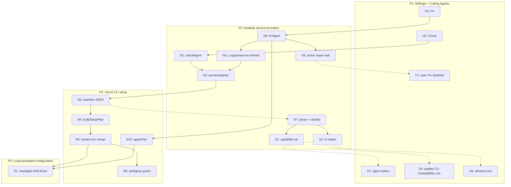

# Detail G: CLI-owned merge with truthful Desktop compatibility

## Parts

| Part | Mechanism | Flag |
|---|---|:---:|
| G1 | CLI parses only managed-block declaration lines. For each selected export name, replace its single existing declaration in place or append it if absent. Preserve omitted peer declarations, their order, all other managed-block lines, and every byte outside the block. | |
| G2 | Duplicate selected names, malformed delimiters, or ambiguous owned declarations produce an error/skipped reason. They never become `unchanged`. | |
| G3 | Existing full-file equality remains the write gate. G1 makes a satisfied invocation byte-identical, so preview returns `unchanged` and apply performs no write. | |
| G4 | CLI machine output adds `capabilities: ["coding-agents-owned-env-merge-v1"]` to dry-run, already-configured, and apply success payloads. | |
| G5 | Desktop `parseAgentPlan` retains the capability set. Environment changes contribute to row status only when G4 is present. Otherwise the Coding Agents pane shows one compatibility message, suppresses CLI-agent Fix, and asks the user to update their installed CLI then recheck. | |
| G6 | CLI warning JSON adds `blocksConfiguration` and an owning agent ID. Desktop renders non-blocking warnings as advisories and treats only row-owned blocking warnings, explicit changes, or errors as red. | |
| G7 | Desktop holds one shared CLI-agent repair task at a time, disables all CLI-agent Fix buttons during it, then rechecks only its explicit supported IDs (`claude-code`, `codex`, `opencode`, `pi`). It never calls CLI `--all`; fx remains independent. | |
| G8 | Temporal regression coverage drives both peer orders and selected-agent permutations through preview → apply → preview, plus relaunch-equivalent reconstruction of Desktop state. | |

## Places

| # | Place | Description |
|---|---|---|
| P1 | Settings > Coding Agents | Existing row list and one new shared CLI compatibility/advisory surface. |
| P2 | Vercel Desktop service boundary | Swift orchestration and setup JSON interpretation. |
| P3 | Vercel CLI coding-agents setup | Authoritative agent plan, owned shell merge, preview, and apply. |
| P4 | Local persistent configuration | Managed shell block, agent files, and Keychain-backed references. |

## UI affordances

| # | Place | Component | Affordance | Control | Wires Out | Returns To |
|---|---|---|---|---|---|---|
| U1 | P1 | Coding Agents pane | agent row status icon and actionable message | render | — | — |
| U2 | P1 | Coding Agents pane | Check button | click | → N1 | — |
| U3 | P1 | Coding Agents pane | Fix button for a hard row-owned defect | click | → N9 | — |
| U0 | P3 | CLI stdout | dry-run/apply JSON outcome | render | — | — |
| U4 | P1 | Coding Agents pane | shared “Update Vercel CLI, then recheck” compatibility message | render | — | — |
| U6 | P1 | Coding Agents pane | advisory text | render | — | — |
| U7 | P1 | Coding Agents pane | peer Fix buttons disabled while shared repair runs | render | — | — |

## Code affordances

| # | Place | Component | Affordance | Control | Wires Out | Returns To |
|---|---|---|---|---|---|---|
| N1 | P2 | `AppModel.checkAgent` | request one supported agent preview | call | → N2 | → U1, U4, U6 |
| N2 | P2 | `VercelService.previewAgents` | execute setup `--dry-run --agent <id>` | call | → N3 | → N1 |
| N3 | P3 | `runMachine` | emit structured preview with changes, warnings carrying `blocksConfiguration` and owner, skipped, and capabilities | call | → N4 | → N2 |
| N4 | P3 | `buildSetupPlan` | collect selected agent file changes and exports | call | → N5 | → N3, N10 |
| N5 | P3 | owned environment merge | replace selected declaration in place, append missing, preserve omitted peers | transform | → S1 | → N4 |
| N6 | P3 | ambiguity guard | reject duplicate/malformed selected declarations | validate | → N3 | → N5 |
| N7 | P2 | `parseAgentPlan` + status classifier | branch on G4 capability; separate hard changes, blocking row-owned warnings, shared Environment, and advisories | parse | → S2, S3 | → N1 |
| N9 | P2 | `AppModel.fixAgent` | acquire shared repair task, apply one agent, then request supported-row refresh | call | → N10, N11, S4 | → U1, U7 |
| N10 | P3 | `applyPlan` | full-file equality gate and existing write path | call | → S1 | → N9 |
| N11 | P2 | supported-row refresh | preview explicit Desktop IDs, never `--all` | call | → N2 | → N9 |

## Data stores

| # | Place | Store | Description |
|---|---|---|---|
| S1 | P4 | managed shell environment block | Shared persistent resource owned by CLI setup. |
| S2 | P2 | setup capability set | Ephemeral capabilities parsed from the current CLI response. |
| S3 | P2 | per-agent check state plus shared compatibility/advisory state | Ephemeral UI model rebuilt on pane entry or relaunch. |
| S4 | P2 | active CLI repair task | Ephemeral mutual-exclusion state shared by non-fx rows. |

## Wiring

## Fit check

| Req | Requirement | Status | G |
|---|---|---|---|
| R0 | Repeated checks without external change are stable. | Core goal | ✅ |
| R1 | Repairing one agent cannot make a configured peer require repair. | Must-have | ✅ |
| R2 | Relaunch cannot change effective configuration or status. | Must-have | ✅ |
| R3 | Green means the required current configuration is usable. | Must-have | ✅ |
| R4 | Red is a row-owned actionable defect. | Must-have | ✅ |
| R5 | Credential and Keychain guarantees remain. | Must-have | ✅ |
| R6 | Supported agents and working files remain preserved. | Must-have | ✅ |
| R7 | Standalone CLI configures one or several selected agents. | Must-have | ✅ |
| R8 | Omission preserves peer exports. | Must-have | ✅ |
| R9 | Repair is idempotent. | Must-have | ✅ |
| R10 | Order-only differences never become row failures. | Derived | ✅ |
