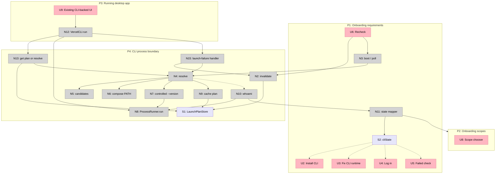
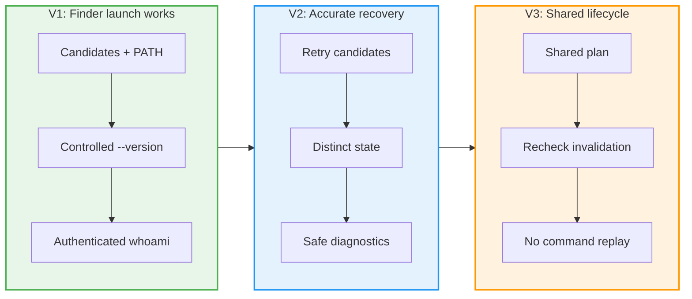

# Vercel Desktop CLI runtime resolution: Big Picture

**Selected shape:** A, direct CLI execution with a deterministic runtime-inclusive PATH

## Frame

### Problem

- Vercel Desktop accepts an executable Vercel CLI file without proving that Finder-launched macOS can execute its interpreter.
- A Bun-installed CLI using `#!/usr/bin/env node` fails with status `127` when Node exists only under NVM.
- The app collapses that launch failure into `.signedOut` and tells an already-authenticated user to log in.

### Outcome

- Common PATH, Homebrew, `/usr/local`, pnpm, fnm, Bun, and NVM installations can be executed from a graphical app environment.
- Missing, unusable, signed-out, ready, and later API failure remain distinct.
- Onboarding and every later command use one validated launch plan without shell-profile execution or persistent resolver state.

## Shape

### Fit check: R × A

| Req | Requirement | Status | A |
|---|---|---|:---:|
| R0 | If a supported Vercel CLI and its required runtime are installed in a common user-level macOS layout, Vercel Desktop can execute the CLI from a normal Finder/LaunchServices environment. | Core goal | ✅ |
| R1 | An authenticated CLI is recognized as authenticated without requiring relogin or user-created symlinks. | Must-have | ✅ |
| R2 | CLI absence, unusable CLI installation/runtime, signed-out CLI, and authenticated-session/API failure remain distinguishable in product state and UI guidance. | Must-have | ✅ |
| R3 | Runtime discovery is deterministic, bounded, and independent of interactive or user shell startup files. | Must-have | ✅ |
| R4 | The selected CLI and runtime pairing is validated by actual execution, not file existence alone. | Must-have | ✅ |
| R5 | A broken higher-priority candidate does not hide a later usable candidate. | Must-have | ✅ |
| R6 | Current working PATH, Homebrew, `/usr/local`, pnpm, fnm, Bun, and NVM layouts preserve their existing behavior. | Must-not-change | ✅ |
| R7 | Every Vercel CLI command in the app uses the same resolved executable/runtime environment as onboarding. | Must-have | ✅ |
| R8 | Resolution and authentication checks do not invoke shell profiles, prompt plugins, package-manager activation hooks, or network installation. | Must-have | ✅ |
| R9 | Paths containing spaces and symlinked CLI entrypoints are launched without shell-string interpolation. | Must-have | ✅ |
| R10 | On failure, diagnostics retain the attempted executable, launch category, exit status, and sanitized stderr needed for actionable UI and support. | Must-have | ✅ |
| R11 | Resolution does not mutate the user's filesystem, PATH, shell configuration, CLI authentication, or installed runtimes. | Must-not-change | ✅ |
| R12 | Unit tests can cover candidate ordering, runtime pairing, retry, and state classification without depending on the developer's machine. | Must-have | ✅ |
| R13 | At least one packaged-app or sanitized-environment integration test proves the shipped process boundary against a script using `#!/usr/bin/env node`. | Must-have | ✅ |
| R14 | Existing successful CLI commands retain current arguments, noninteractive behavior, timeout behavior, output capture, and working directory. | Must-not-change | ✅ |
| R15 | The fix remains scoped to Vercel CLI discovery/execution and onboarding diagnostics; it does not become a general shell-environment emulation system. | Must-have | ✅ |
| R16 | Any cached launch plan is in-process derived state, is cleared by Recheck, is invalidated after a launch failure, permits one bounded re-resolution, and does not survive app restart. | Derived must-have | ✅ |

### Parts

| Part | Mechanism | Flag |
|---|---|:---:|
| A1 | Preserve ordered CLI candidates and compose one bounded, normalized, deduplicated runtime-inclusive PATH. | |
| A2 | Store executable plus environment as `LaunchPlan`; launch the CLI URL directly with argument arrays. | |
| A3 | Validate candidates in order with status/output inspection and retry later candidates after unusable results. | |
| A4 | Use a controlled `--version` launchability probe, then structured `whoami` authentication classification. | |
| A5 | Cache only in process; clear on Recheck and invalidate after launch-level failure. | |
| A6 | Route every `VercelCLI.run` consumer through the selected plan while preserving command contracts. | |
| A7 | Add `.unusable` and structured bounded sanitized diagnostics. | |
| A8 | Add injected unit coverage and a hermetic sanitized-environment process-boundary test. | |

### Breadboard

Legend:

- Pink nodes are user-visible affordances.
- Grey nodes are code affordances.
- Purple nodes are stores.
- Solid arrows are calls or writes. Dashed arrows are returned data.

## Slices

|  |  |  |
|:--|:--|:--|
| **[V1: Finder launch works](./v1-plan.md)** ⏳ PENDING  • Bounded composed PATH • Direct process launch • Controlled version probe • Authenticated whoami  *Demo: Finder-like onboarding reaches scopes* | **[V2: Accurate recovery](./v2-plan.md)** ⏳ PENDING  • Candidate retry • `.unusable` state • Runtime guidance • Sanitized diagnostics  *Demo: Broken runtime is not reported as signed out* | **[V3: Shared lifecycle](./v3-plan.md)** ⏳ PENDING  • Every command reuses plan • Recheck invalidates • One bounded re-resolution • No mutating command replay  *Demo: Onboarding and service action use identical plan* |
