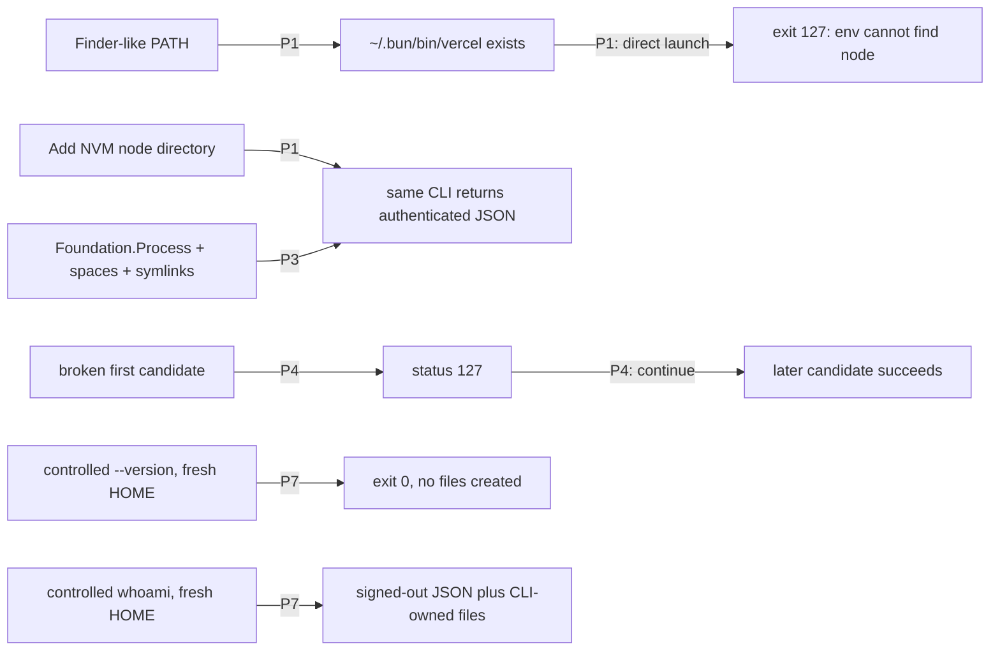
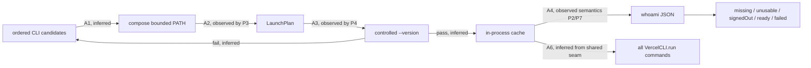

# Decision: Vercel Desktop CLI runtime resolution

## Verdict

**Pass to detail.**

Selected shape: **OpenAI Shape A, Direct CLI execution with deterministic runtime PATH pairing**, as amended after P7 in `shaping-openai-final.md`.

Target base: `vercel-labs/vercel-desktop@c77537352ec3b1afee0a0c8e53ac8d1052248fa8` (`v0.0.19`).

Mode: greenfield.

Gate trigger: the defect crosses executable discovery, interpreter availability, process launch, authentication classification, shared command execution, and onboarding guidance. A file-existence patch would not determine the correct mechanism.

## Reviewer provenance

| Pass | Runtime family | Isolation | Result |
|---|---|---|---|
| Reviewer 1 | OpenAI, GPT-5.6-sol | Clean clone at target base; frozen packet only | Shape A survived after P1–P7 and has no flags. |
| Reviewer 2 | Anthropic, Haiku | Separate clean clone at target base; frozen packet only | Converged on launch-plan validation and retry, but its final B2 flag contradicts its all-pass fit check. Retained as provenance, not selected. |
| Synthesis | Codex root runtime | Canonical run artifacts plus observed probes | Selected amended Shape A; no averaging or vote. |

Two earlier Anthropic attempts timed out or exceeded their run budget. They produced no gate artifact and have no decision weight.

## Reconciled requirements

| Req | Requirement | Status | Shape A |
|---|---|---|:---:|
| R0 | If a supported Vercel CLI and its required runtime are installed in a common user-level macOS layout, Vercel Desktop can execute the CLI from a normal Finder/LaunchServices environment. | Core goal | ✅ |
| R1 | An authenticated CLI is recognized as authenticated without requiring relogin or user-created symlinks. | Must-have | ✅ |
| R2 | CLI absence, unusable CLI installation/runtime, signed-out CLI, and authenticated-session/API failure remain distinguishable in product state and UI guidance. | Must-have | ✅ |
| R3 | Runtime discovery is deterministic, bounded, and independent of interactive or user shell startup files. | Must-have | ✅ |
| R4 | The selected CLI and runtime pairing is validated by actual execution, not file existence alone. | Must-have | ✅ |
| R5 | A broken higher-priority candidate does not hide a later usable candidate. | Must-have | ✅ |
| R6 | Current working PATH, Homebrew, `/usr/local`, pnpm, fnm, Bun, and NVM layouts preserve their existing behavior. | Must-not-change | ✅ |
| R7 | Every Vercel CLI command in the app uses the same resolved executable/runtime environment as onboarding. | Must-have | ✅ |
| R8 | Resolution and authentication checks do not invoke shell profiles, prompt plugins, package-manager activation hooks, or network installation. | Must-have | ✅ |
| R9 | Paths containing spaces and symlinked CLI entrypoints are launched without shell-string interpolation. | Must-have | ✅ |
| R10 | On failure, diagnostics retain the attempted executable, launch category, exit status, and sanitized stderr needed for actionable UI and support. | Must-have | ✅ |
| R11 | Resolution does not mutate the user's filesystem, PATH, shell configuration, CLI authentication, or installed runtimes. | Must-not-change | ✅ |
| R12 | Unit tests can cover candidate ordering, runtime pairing, retry, and state classification without depending on the developer's machine. | Must-have | ✅ |
| R13 | At least one packaged-app or sanitized-environment integration test proves the shipped process boundary against a script using `#!/usr/bin/env node`. | Must-have | ✅ |
| R14 | Existing successful CLI commands retain current arguments, noninteractive behavior, timeout behavior, output capture, and working directory. | Must-not-change | ✅ |
| R15 | The fix remains scoped to Vercel CLI discovery/execution and onboarding diagnostics; it does not become a general shell-environment emulation system. | Must-have | ✅ |
| R16 | Any cached launch plan is in-process derived state, is cleared by Recheck, is invalidated after a launch failure, permits one bounded re-resolution, and does not survive app restart. | Derived must-have | ✅ |

No requirements remain undecided.

## Selected mechanism

| Part | Mechanism | Evidence |
|---|---|---|
| A1 | Preserve the current ordered executable candidates. Compose one finite PATH from the candidate directory, inherited entries, current fixed directories, fnm, and at most 24 semver-ordered NVM directories; normalize and deduplicate by first occurrence. | P6; current Swift source; retired Zig bounded precedent. |
| A2 | Store executable URL plus complete environment as a validated `LaunchPlan`. Execute the CLI URL directly with argument arrays through `Foundation.Process`. Do not parse shebangs or invoke Node explicitly. | P1, P3. |
| A3 | Run `--version` for each candidate in order and inspect throw, timeout, status, stdout, and stderr. Continue after unusable candidates, including a launched process exiting `127`. | P4. |
| A4 | Overlay `NO_UPDATE_NOTIFIER=1` and `VERCEL_TELEMETRY_DISABLED=1` on the added `--version` probe. After selection, run structured `whoami` to classify authentication. | P2, P7. |
| A5 | Cache the selected plan in process. Recheck clears it. A later launch failure invalidates it and permits one bounded re-resolution. | Frozen temporal contract, R16. |
| A6 | Route onboarding and every service command through the same plan while preserving command-specific arguments, environment overlays, timeout, output capture, and `/tmp` working directory. | Current single `VercelCLI.run` seam. |
| A7 | Add `.unusable` between `.missing` and `.signedOut`; retain structured diagnostics for unusable and failed outcomes. | P2, P4; current UI/state evidence. |
| A8 | Test resolver mechanics with injected inputs and prove the real process boundary with hermetic fake executables, spaces, symlinks, and fresh-HOME mutation assertions. | P3, P5, P7. |

## Observed behavior

Every arrow below is observed and cites the corresponding probe.

P7 limits the R11 claim precisely. Runtime resolution is the controlled `--version` phase and is mutation-free. `whoami` is the subsequent authentication phase and Vercel CLI 59.1.4 itself creates config and telemetry identity files even when sending telemetry is disabled. The fix does not add those writes and does not claim to suppress all behavior of arbitrary CLI commands.

## Proposed flow

This diagram is a proposed mechanism, not observed behavior.

## Forward effects

### FWD1: repaired launch plan reaches authenticated onboarding

1. A1 puts a bounded NVM runtime directory in the composed PATH. **Observed basis:** P1 and P6.
2. A2 passes that PATH to direct `Foundation.Process` execution of the Bun symlink. **Observed:** P3.
3. `/usr/bin/env node` resolves and `--version` exits `0`. **Observed:** P1, P3, P7.
4. A4 then runs `whoami` through the same plan and parses authenticated JSON. **Observed semantics:** P1 and P7 authenticated control.
5. Onboarding becomes `.ready` instead of `.signedOut`. **Inferred** from current `CLIState` flow plus A7.

Harmful branch: a runtime can launch `--version` but fail a later command. A5 invalidates the plan only for launch-level failure and performs one bounded re-resolution. Command-level API or authentication failures remain `.failed` or `.signedOut`; they do not trigger an unbounded runtime hunt.

### FWD2: retry changes which executable wins only when necessary

1. A3 executes the highest-priority candidate rather than trusting executable-file metadata. **Observed basis:** P4.
2. A status `127`, timeout, thrown launch error, or invalid version result marks that plan unusable. **Observed:** P1, P4; timeout behavior inferred from `ProcessRunner`.
3. Resolution continues to the next existing candidate in the current order. **Inferred** mechanism with retired Zig precedent in P6.
4. A later usable installation can become the cached plan. **Observed fixture:** P4.

Helpful branch: a stale Bun installation no longer hides a working Homebrew/NVM installation. Harmful branch: Desktop may select a lower-priority CLI than Terminal. A7 retains every attempted executable and category, so support can explain the selection; A8 pins ordering and retry.

### FWD3: product guidance stops prescribing login for runtime failure

1. A4 separates launchability from `whoami` authentication. **Observed basis:** P2 and P4.
2. A7 maps “no file” to `.missing`, “files but no passing plan” to `.unusable`, structured `loggedIn:false` to `.signedOut`, authenticated identity to `.ready`, and later API failures to `.failed`. **Inferred** state mechanism from observed command semantics.
3. Onboarding renders install, runtime repair, login, or generic API guidance from the distinct state. **Inferred** from current `OnboardingView` wiring.

Harmful branch: raw stderr could expose tokens or private paths. A7 requires bounded, sanitized diagnostics and user guidance derived from launch category, not raw stderr rendering.

### FWD4: one plan coordinates all CLI consumers

1. A5 caches a complete plan, not merely an executable URL. **Inferred.**
2. A6 makes the existing central `VercelCLI.run` seam consume it. **Inferred from current source.**
3. Onboarding, user/team APIs, AI Gateway commands, usage, and agent setup inherit the same runtime PATH. **Inferred from current call sites.**
4. Recheck or one launch-level failure clears derived state and resolves from current disk state. **Inferred from R16.**

Helpful branch: later commands cannot regress to the Finder PATH. Harmful branch: stale cached state could survive an install change. R16 designs this out through explicit Recheck, launch-failure invalidation, one retry, and process-only lifetime.

## Failure-shape score

| Case | Result | Design response |
|---|---|---|
| S1 Over-reach | Designed out | Preserve candidate sources/order and the central command contract. Do not source profiles, parse arbitrary shebangs, bundle Node, or generalize to shell emulation. Regression cells cover already-working PATH, Homebrew, pnpm, fnm, Bun, and NVM paths. |
| S2 Under-reach | Designed out | Class-level tests include Bun CLI + NVM Node, broken-first/later-good, symlink, spaces, signed-out status `1`, and missing interpreter status `127`, not only the reported machine. |
| S3 Direction inheritance | Designed out | The shared plan covers both discovery/onboarding and every downstream command. Later launch failure drives invalidation in the opposite direction. |
| S4 Proxy property | Designed out | Executable-file existence is replaced by actual `--version` execution with status/output inspection. Authentication is separately proven by structured `whoami`. |
| S5 Unregistered peer | Designed out | The only new stateful object is an in-process cache owned and cleared by the same resolver. No files, defaults, or cross-process state are added. |
| S6 Peer-version blindness | Not applicable | No new cross-process protocol is introduced. Compatibility is tested by executing the installed CLI itself. |
| S7 Wrong layer | Designed out | The selected plan feeds the central execution seam; structured categories feed `CLIState` and onboarding guidance. Diagnostics have an explicit product/support consumer. |
| S8 Guard-derived cells | Designed out | Test cells derive from supported installation layouts and process outcomes, including variants the implementation must not special-case. |
| S9 Test pins wrong thing | Designed out | Separate tests must fail when composed runtime PATH, retry, shared-plan reuse, state classification, cache invalidation, or mutation controls are removed. The integration fixture crosses `Foundation.Process`. |
| S10 Claim from prose | Designed out | Direct launch, exit `127`, signed-out status `1`, authenticated JSON, spaces/symlinks, and fresh-HOME writes were executed against CLI 59.1.4. |
| S11 Asymmetric validation | Designed out | Resolver and every CLI consumer share the same validated `LaunchPlan`; no downstream command reconstructs a weaker environment. |
| S12 Primitive-contract mismatch | Designed out | P3 proves the selected primitive, direct `Process.executableURL` plus runtime-inclusive PATH, against the actual `#!/usr/bin/env node` contract. Explicit Node invocation is rejected. |
| S13 Invocation-state collapse | Designed out | R16 defines no-cache, cached, invalidated, Recheck, and restart transitions. Omission does not clear user configuration because the cache is derived and internal. |

No catalog hit is accepted as residual risk.

## Carried assumptions and implementation verification targets

- The 24-version NVM cap and semantic ordering remain sufficient for supported common layouts. Verify with unit fixtures and document any field evidence that requires another explicit bounded source.
- `--version` remains a valid launchability discriminator for supported Vercel CLI releases. If a future CLI changes it, update the probe based on execution evidence rather than stderr wording.
- Sanitization must redact tokens, credentials, and sensitive argument values and bound stderr size before diagnostics reach logs or UI.
- Re-resolution is triggered only by launch-level failure. An API error must not silently switch CLI installations.
- P7's no-write guarantee applies to the added controlled resolution probe. It does not apply to `whoami` or arbitrary service commands owned by Vercel CLI.

## Gate handoff

Shaping receives all R0–R16, selected parts A1–A8, P1–P7, and the carried assumptions for detail, breadboarding, and slicing.

Review Gate receives R0–R16 as executable checks, with extra weight on R6, R11, and R14. It must require mechanism-specific negative tests for composed PATH, retry, shared-plan reuse, and state separation.

Implementation is not authorized by this gate and has not been performed.
