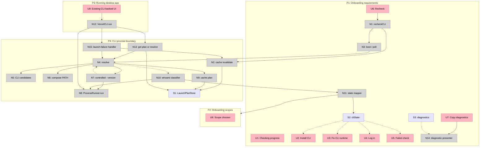

# Detail A: Runtime-inclusive Vercel CLI launch plan

Status: selected by `decision.md` and passed to Shaping.

This is proposed design. Existing affordance names match base `c775373`; new names are concrete implementation targets.

## Concrete contracts

| Contract | Proposed shape |
|---|---|
| `LaunchPlan` | Executable URL plus complete environment. The environment contains one ordered, normalized, deduplicated PATH. |
| `LaunchAttempt` | Executable URL, launch category, optional status, and bounded sanitized stderr. |
| `ResolutionResult` | `.usable(LaunchPlan)`, `.missing`, or `.unusable([LaunchAttempt])`. |
| `LaunchPlanStore` | Synchronous, lock-protected, process-only cache. It exposes get, replace, and invalidate. It never persists. |
| `CLIState` | Add `.unusable`; keep `.missing`, `.signedOut`, `.ready`, and `.failed`. |
| Resolution probe | Direct executable plus `--version`, with `NO_UPDATE_NOTIFIER=1` and `VERCEL_TELEMETRY_DISABLED=1`. |
| Authentication probe | Same selected plan plus `whoami --json --no-color --non-interactive`; parse structured JSON even when status is nonzero. |
| Later launch failure | Invalidate and resolve once using `--version`. Do not replay the failed service command. A timeout or ordinary command failure is not automatically retried. |

## Ordered PATH composition

For each CLI candidate, compose one PATH in this order:

1. Candidate executable directory.
2. Existing GUI process PATH entries, preserving order.
3. Existing explicit fixed entries: `/opt/homebrew/bin`, `/usr/local/bin`, `/usr/bin`, `/bin`.
4. `PNPM_HOME` when set.
5. `BUN_INSTALL/bin` when set.
6. fnm default alias directory.
7. `~/Library/pnpm`, `~/.local/share/pnpm`, and `~/.bun/bin`.
8. At most 24 directories below the effective `NVM_DIR/versions/node`, ordered by parsed semantic version descending.

Normalize absolute directory URLs and preserve the first occurrence. Do not source a shell, run a package-manager activation hook, inspect a shebang, or enumerate an unbounded tree.

## Places

| # | Place | Description |
|---|---|---|
| P1 | Onboarding requirements | Vercel Desktop checks CLI installation, launchability, and authentication and gives the user the next action. |
| P2 | Onboarding scopes | Existing next screen reached only after an authenticated CLI and account/team discovery succeed. |
| P3 | Running desktop app | Existing status bar, settings, usage, key, and coding-agent workflows that invoke Vercel CLI commands. |
| P4 | CLI process boundary | `Foundation.Process` executes an installed Vercel CLI with an explicit URL, argument array, environment, timeout, and `/tmp` working directory. |

## UI affordances

| # | Place | Component | Affordance | Control | Wires Out | Returns To |
|---|---|---|---|---|---|---|
| U1 | P1 | `OnboardingView.requirements` | “Checking the Vercel CLI…” progress | render | - | - |
| U2 | P1 | `OnboardingView.requirements` | Install CLI guidance | render | - | - |
| U3 | P1 | `OnboardingView.requirements` | Fix CLI runtime guidance | render | - | - |
| U4 | P1 | `OnboardingView.requirements` | Log in guidance | render | - | - |
| U5 | P1 | `OnboardingView.requirements` | Failed check guidance | render | - | - |
| U6 | P1 | `OnboardingView` | Recheck button | click | → N1 | - |
| U7 | P1 | `OnboardingView` | Copy sanitized diagnostics button | click | → N14 | - |
| U8 | P2 | `OnboardingView.scopes` | Scope chooser | render | - | - |
| U9 | P3 | Existing desktop UI | Existing CLI-backed actions and displays | interact/render | → N12 | - |

## Code affordances

| # | Place | Component | Affordance | Control | Wires Out | Returns To |
|---|---|---|---|---|---|---|
| N1 | P1 | `AppModel` | `recheckCLI()` | call | → N2, → N3 | - |
| N2 | P1 | `LaunchPlanStore` | `invalidate()` | call | → S1 | - |
| N3 | P1 | `AppModel.boot()` / polling | start check | call | → N4 | - |
| N4 | P4 | `LaunchPlanResolver` | `resolve()` | call | → N5, → N6, → N7 | → N3, N12 |
| N5 | P4 | `LaunchPlanResolver` | ordered CLI candidate enumeration | read | - | → N4 |
| N6 | P4 | `LaunchPlanResolver` | bounded PATH composition | read/compose | - | → N4 |
| N7 | P4 | `LaunchPlanResolver` | validate candidate with controlled `--version` | call | → N8 | → N4 |
| N8 | P4 | `ProcessRunner.run()` | execute URL plus argument array | call | - | → N7, N10, N12 |
| N9 | P4 | `LaunchPlanStore` | cache usable `LaunchPlan` | write | → S1 | - |
| N10 | P4 | `VercelCLI.onboardingState()` / `session()` | structured `whoami` classification | call | → N8, → N11 | → N3 |
| N11 | P1 | `CLIState` mapper | map missing, unusable, signedOut, ready, failed | write | → S2 | → U2, U3, U4, U5, P2 |
| N12 | P3 | `VercelCLI.run()` | execute service command through cached plan | call | → N13, → N8 | → U9 |
| N13 | P4 | `VercelCLI` | get cached plan or resolve | read/call | → S1, → N4 | → N12 |
| N14 | P1 | Diagnostic presenter | copy bounded sanitized launch evidence | call | → S3 | - |
| N15 | P4 | Launch-failure handler | invalidate and resolve once without replaying command | call | → N2, → N4 | → N12 |

## Data stores

| # | Place | Store | Description |
|---|---|---|---|
| S1 | P4 | In-process `LaunchPlanStore` | Selected executable and complete environment. Cleared on Recheck, launch failure, and process exit. |
| S2 | P1 | `AppModel.cliState` | Existing observable product state extended with `.unusable`. |
| S3 | P1 | In-process CLI diagnostics | Bounded sanitized attempts for current check. No persistence and no raw tokens. |

## Wiring

## Classification table

| Evidence | Product state | Guidance | Cache |
|---|---|---|---|
| No candidate executable file | `.missing` | Install Vercel CLI | Empty |
| Candidate files exist; none passes controlled `--version` | `.unusable` | Repair/install Node runtime or CLI; Recheck; allow copied diagnostics | Empty |
| Plan passes; `whoami` returns structured `loggedIn:false` | `.signedOut` | Run `vercel login` | Keep usable plan |
| Plan passes; `whoami` returns a username | `.ready` | Continue to scopes | Keep usable plan |
| Plan passes; `whoami` or later user/team API fails for another reason | `.failed` | Recheck and support-oriented diagnostics | Keep plan unless failure is launch-level |

## Temporal transitions

| Prior state | Action | Required result |
|---|---|---|
| No cache | Boot or polling check | Resolve once, cache a usable plan, then classify authentication. |
| Cached plan | Service command | Use the exact executable and environment in S1. |
| Cached plan | Recheck | Clear S1 and diagnostics, then resolve from current disk and environment. |
| Cached plan | Process cannot launch or returns interpreter-level `127` | Clear S1, resolve once with `--version`, return the original command failure, and do not replay the command. |
| Cached plan | Timeout or ordinary nonzero command exit | Return the command failure without automatic replay or runtime switching. |
| Any state | App restart | Start with empty S1 and resolve again. |

## Diagnostic sanitation

Keep executable path, category, optional status, and at most 2 KiB of stderr per attempt. Before storage or display, redact values associated with `--token`, `VERCEL_TOKEN`, `vck_` secrets, bearer tokens, and authorization headers. UI guidance must use categories, not raw stderr. Diagnostics remain in process.
