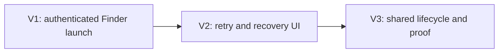

# Slices: Runtime-inclusive Vercel CLI launch plan

## Slice summary

| # | Slice | Shape parts | Observable demo | Validation |
|---|---|---|---|---|
| V1 | Finder launch recognizes Bun CLI with NVM Node | A1, A2, A4, A5, A6 | In a sanitized Finder-like environment, onboarding advances to scopes for the existing authenticated Bun CLI without symlinks or relogin. | Candidate/PATH unit tests, direct process-boundary integration fixture, real P1-equivalent manual check. |
| V2 | Broken installations get accurate recovery | A3, A7 | A broken higher-priority CLI is skipped for a later usable CLI; if none is usable, onboarding shows runtime repair rather than login and exposes sanitized diagnostics. | Retry/classification matrix with `127`, throw, timeout, signed-out status `1`, API failure, and mutation assertion. |
| V3 | Every command keeps the validated plan | A5, A6, A8 | After onboarding, an existing CLI-backed action succeeds under the same sanitized environment; Recheck and launch failure replace stale derived state without replaying a mutating command. | Cache lifecycle/concurrency tests, command-contract regression tests, fresh-HOME integration test. |

## Dependency order

Each slice can merge and revert independently. V1 leaves existing failure guidance intact. V2 adds the new product distinction. V3 hardens every downstream consumer and closes the complete R7/R14/R16 lifecycle.

## V1 affordances

| # | Component | Affordance | Control | Wires Out | Returns To |
|---|---|---|---|---|---|
| U1 | `OnboardingView` | Checking progress | render | - | - |
| U8 | `OnboardingView` | Scope chooser | render | - | - |
| N3 | `AppModel.boot()` | Start CLI check | call | → N4 | - |
| N4 | `LaunchPlanResolver` | Resolve ordered candidates | call | → N5, N6, N7 | → N10 |
| N5 | `LaunchPlanResolver` | Candidate enumeration | read | - | → N4 |
| N6 | `LaunchPlanResolver` | Bounded PATH composition | compose | - | → N4 |
| N7 | `LaunchPlanResolver` | Controlled `--version` | call | → N8 | → N4 |
| N8 | `ProcessRunner` | Execute argument array | call | - | → N7, N10 |
| N9 | `LaunchPlanStore` | Cache usable plan | write | → S1 | - |
| N10 | `VercelCLI` | Structured `whoami` | call | → N8 | → U8 |
| S1 | `LaunchPlanStore` | Process-only selected plan | store | - | → N10 |

Plan: `v1-plan.md`.

## V2 affordances

| # | Component | Affordance | Control | Wires Out | Returns To |
|---|---|---|---|---|---|
| U3 | `OnboardingView` | Fix CLI runtime guidance | render | - | - |
| U4 | `OnboardingView` | Log in guidance | render | - | - |
| U5 | `OnboardingView` | Failed check guidance | render | - | - |
| U6 | `OnboardingView` | Recheck | click | → N1 | - |
| U7 | `OnboardingView` | Copy diagnostics | click | → N14 | - |
| N1 | `AppModel` | Recheck handler | call | → N2, N4 | - |
| N2 | `LaunchPlanStore` | Invalidate | call | → S1 | - |
| N4 | `LaunchPlanResolver` | Continue after unusable candidate | call | → N7 | → N11 |
| N11 | `CLIState` mapper | Distinct state classification | write | → S2 | → U3, U4, U5 |
| N14 | Diagnostic presenter | Sanitize and copy attempts | call | → S3 | - |
| S2 | `AppModel.cliState` | Includes `.unusable` | store | - | → U3, U4, U5 |
| S3 | CLI diagnostics | Current bounded attempts | store | - | → N14 |

Plan: `v2-plan.md`.

## V3 affordances

| # | Component | Affordance | Control | Wires Out | Returns To |
|---|---|---|---|---|---|
| U9 | Existing desktop UI | CLI-backed action/display | interact/render | → N12 | - |
| N12 | `VercelCLI.run()` | Execute through selected plan | call | → N13, N8, N15 | → U9 |
| N13 | `VercelCLI` | Get cached plan or resolve | read/call | → S1, N4 | → N12 |
| N15 | `VercelCLI` | Handle launch-level failure | call | → N2, N4 | → N12 |
| S1 | `LaunchPlanStore` | Shared exact executable and environment | store | - | → N13 |

Plan: `v3-plan.md`.

## Review Gate matrix

| Mechanism removed or broken | Test that must fail |
|---|---|
| NVM runtime entries omitted from composed PATH | Sanitized Bun-CLI/NVM-Node integration fixture. |
| Candidate directory or inherited PATH order changes | Exact ordered-path unit fixture. |
| Resolver accepts executable-file existence | Broken interpreter fixture must reject the plan. |
| Resolver stops after status `127` | Broken-first/later-good fixture. |
| `NO_UPDATE_NOTIFIER` removed from `--version` probe | Fresh-HOME no-files assertion. |
| Nonzero `whoami` always means unusable | Signed-out JSON status `1` classifier test. |
| CLI failure always means signed out | API-failure classifier test. |
| Service command reconstructs PATH | Exact-plan identity test at `VercelCLI.run`. |
| Cache survives Recheck | Recheck transition test. |
| Failed mutating command is replayed | Runner call-count test remains exactly one for the command. |
| Raw stderr reaches UI/log | Secret-bearing fixture redaction test. |
