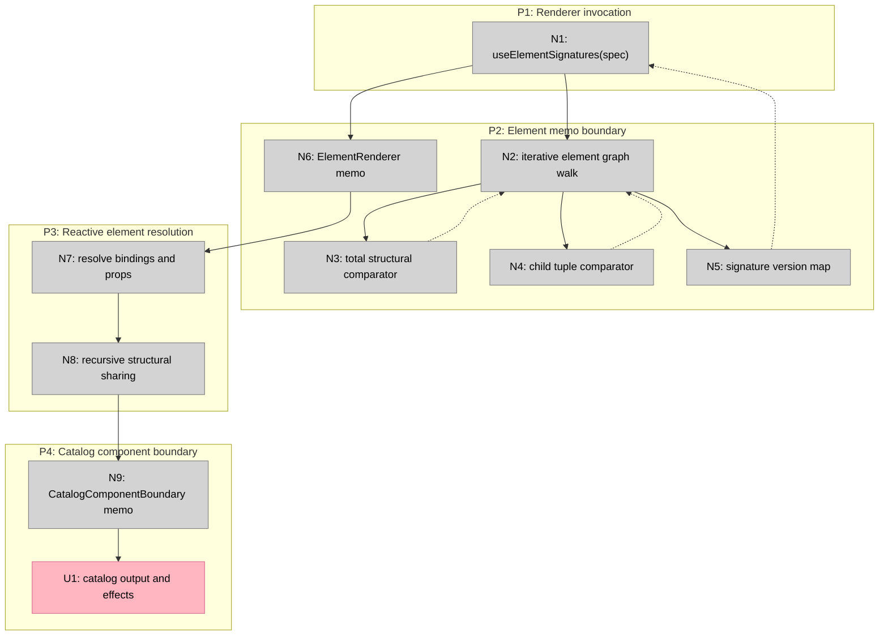

# JSON Render PR #325 breadboard

## Places

| # | Place | Description |
|---|---|---|
| P1 | Renderer invocation | A complete or streamed `Spec` enters the React renderer. |
| P2 | Element memo boundary | Element graph signatures decide which internal renderers execute. |
| P3 | Reactive element resolution | Context-dependent props and bindings resolve for an executing element. |
| P4 | Catalog component boundary | Stable resolved values and invalidation inputs decide whether user code executes. |

## UI affordances

No direct UI controls are introduced. The observable surface is catalog
component output and effect execution.

| # | Place | Component | Affordance | Control | Wires Out | Returns To |
|---|---|---|---|---|---|---|
| U1 | P4 | Catalog component | Rendered output and component effects | React render/effect | | N8 |

## Code affordances

| # | Place | Component | Affordance | Control | Wires Out | Returns To |
|---|---|---|---|---|---|---|
| N1 | P1 | `Renderer` | `useElementSignatures(spec)` | render | N2 | |
| N2 | P2 | Signature traversal | Iterative child graph walk | call | N3, N4 | |
| N3 | P2 | Total structural comparator | Compare prior and next own element values without serialization | call | N5 | N2 |
| N4 | P2 | Child tuple comparator | Compare ordered child key/version tuples | call | N5 | N2 |
| N5 | P2 | Signature version map | Reuse or increment each element version | return | N6 | N1 |
| N6 | P2 | `ElementRenderer` memo | Skip or execute the reactive renderer from element version and boundary inputs | React memo | N7 | |
| N7 | P3 | Prop resolver | Resolve bindings and dynamic props | render | N8 | |
| N8 | P3 | Recursive structural sharing | Reuse unchanged resolved subtrees and rebuild changed ancestry | call | N9 | U1 |
| N9 | P4 | `CatalogComponentBoundary` memo | Compare existing context, registry, callback, binding, loading, signature, and shared prop inputs | React memo | U1 | |

## Wiring

Legend:

- Pink is the externally observable catalog surface.
- Grey nodes are internal code affordances.
- Solid lines are control flow.
- Dashed lines are returned comparison or signature data.
