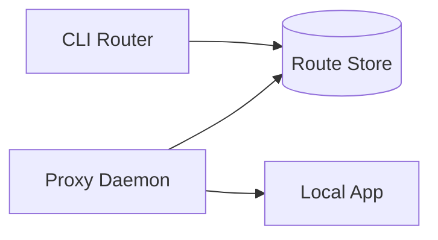
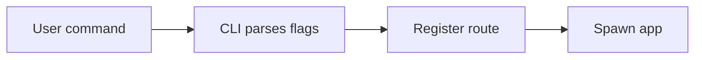
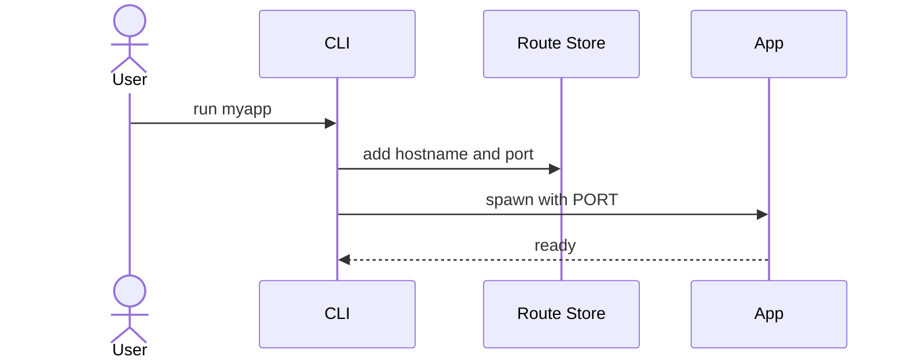
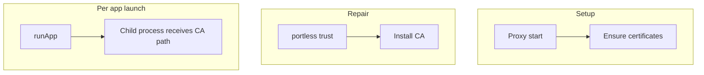
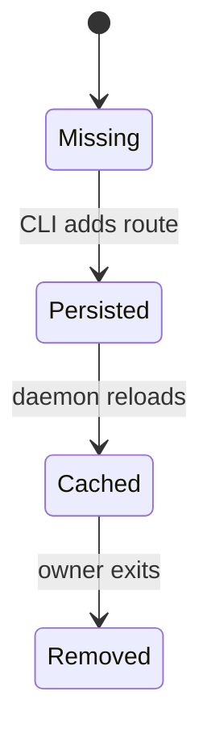

# Visual selection

Use this reference when more than one diagram type seems plausible.

## Architecture Map

Use for stable topology: components, state stores, contracts, external systems, and ownership boundaries.

The edges mean structural dependency or communication, not necessarily temporal order.

## Flow Trace

Use for one operation when the main question is how data or control reaches an outcome.

Add a decision diamond when alternatives matter. Split the diagram when branches make edges cross.

## Sequence Diagram

Use when timing, actor ownership, or request/response order is the point. Include only participants active in the same concrete scenario.

Give setup, manual repair, and per-request runtime separate sequences or lifecycle lanes even when they share a component.

## Lifecycle Map

Use separate lanes for independent phases.

## State Map

Use for ownership, mutation, invalidation, persistence, and rehydration. Name both the mutator and the state.

## Contract Map

Use when the important insight is what crosses a boundary. Label payloads, invariants, errors, and consumers. Avoid turning a contract map into a call graph.

## Failure Map

Start at the observed symptom and work backward through falsifiable hypotheses. Mark proven edges as evidence and unproven edges as inference in the surrounding explanation.

## Change Surface

Show the smallest set of contracts, state, callers, implementations, tests, and docs that a proposed change touches. A file belongs only when its responsibility or dependency justifies it.
