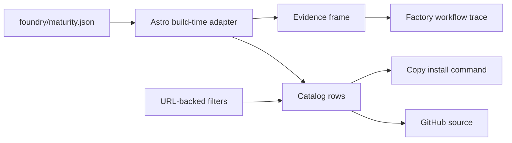

# Railly Skills landing page: big picture

**Selected shape:** B, a build-time repository catalog.

## Frame

### Problem

- The methods lack a dedicated discovery surface.
- Channel and evidence maturity are easy to conflate.
- Installation and workflow relationships require README archaeology.
- The web surface must not destabilize the skill distribution surface.

### Outcome

- `skills.railly.dev` presents the current collection as an inspectable engineering system.
- All registered skills, evidence labels, source links, and install commands derive from repository data.
- The page is static, accessible, responsive, and isolated under `www/`.

## Shape

### Fit check: R × B

| Req | Requirement | Status | B |
|---|---|---|:---:|
| R0 | Explain why the collection is evidence-backed without overstating validation | Core goal | ✅ |
| R1 | Browse every registered skill from repository-owned data | Must-have | ✅ |
| R2 | Distinguish distribution channel from evidence maturity | Must-have | ✅ |
| R3 | Copy an exact install command for the collection or an individual skill | Must-have | ✅ |
| R4 | Preserve catalog filters in a shareable URL | Must-have | ✅ |
| R5 | Expose source, evidence limits, release, and repository links | Must-have | ✅ |
| R6 | Work responsively with keyboard access, visible focus, and reduced-motion support | Must-have | ✅ |
| R7 | Keep the Astro application isolated under `www/` | Must-have | ✅ |
| R8 | Deploy through a Vercel project rooted at `www/` | Must-have | ✅ |
| R9 | Serve production at `skills.railly.dev` | Must-have | ✅ |
| R10 | Require no runtime backend or GitHub API availability | Must-have | ✅ |

### Parts

| Part | Mechanism | Flag |
|---|---|:---:|
| B1 | Build-time adapter derives the catalog from `foundry/maturity.json` | |
| B2 | Evidence-first hero and collection install control | |
| B3 | URL-backed search, channel, and type controls | |
| B4 | Inspectable skill rows with source and copy actions | |
| B5 | CSS/SVG workflow trace | |
| B6 | Explicit evidence ladder and release limits | |
| B7 | Isolated Astro package and CI | |
| B8 | Crafter Station Vercel project rooted at `www/` with `skills.railly.dev` | |

### Breadboard

## Slices

| Slice | Observable result | Status |
|---|---|---|
| V1: Evidence frame | Repository facts, limits, and collection install command are visible | Complete |
| V2: Inspectable catalog | Every skill is searchable, filterable, source-linked, and individually installable | Complete |
| V3: Workflow and finish | The system relationship, responsive layout, theme, and accessibility behavior are visible | Complete |
| V4: Production delivery | Merged site serves from `skills.railly.dev` | Pending until deployment |
