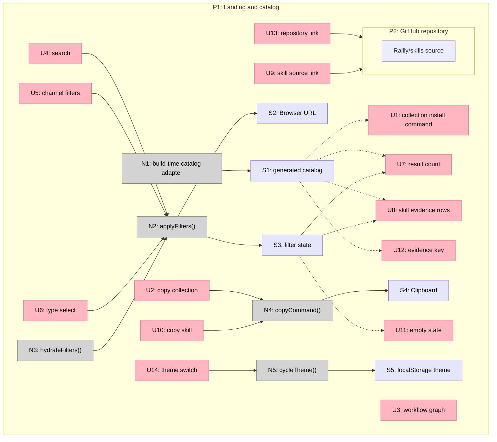

# Railly Skills landing page breadboard

## Places

| # | Place | Description |
|---|---|---|
| P1 | Landing and catalog | One non-blocking page containing the product frame, workflow, filters, and skill catalog |
| P2 | GitHub repository | External source and per-skill documentation destination |

Skill detail remains in P1 as expanded card content. No modal or second local route is required.

## UI affordances

| # | Place | Component | Affordance | Control | Wires Out | Returns To |
|---|---|---|---|---|---|---|
| U1 | P1 | Hero | Collection install command | render | None | None |
| U2 | P1 | Hero | Copy collection command button | click | → N4 | None |
| U3 | P1 | WorkflowGraph | Evidence workflow graph | render | None | None |
| U4 | P1 | Catalog | Search input | input | → N2 | None |
| U5 | P1 | Catalog | Channel filter links | click | → N2 | None |
| U6 | P1 | Catalog | Type select | change | → N2 | None |
| U7 | P1 | Catalog | Result count | render | None | None |
| U8 | P1 | SkillCard | Skill evidence row | render | None | None |
| U9 | P1 | SkillCard | Source link | click | → P2 | None |
| U10 | P1 | SkillCard | Copy skill command button | click | → N4 | None |
| U11 | P1 | Catalog | Empty result state | render | None | None |
| U12 | P1 | EvidenceKey | Maturity definitions and release limit | render | None | None |
| U13 | P1 | Header | GitHub repository link | click | → P2 | None |
| U14 | P1 | Header | Theme switch | click | → N5 | None |

## Code affordances

| # | Place | Component | Affordance | Control | Wires Out | Returns To |
|---|---|---|---|---|---|---|
| N1 | P1 | data/skills | Build-time catalog adapter | import | → S1 | → U7, U8, U12 |
| N2 | P1 | Catalog | `applyFilters()` | call | → S2, S3 | → U7, U8, U11 |
| N3 | P1 | Catalog | `hydrateFilters()` | load/popstate | → N2 | None |
| N4 | P1 | copy controls | `copyCommand()` | call | → S4 | → U2, U10 |
| N5 | P1 | theme control | `cycleTheme()` | call | → S5 | → U14 |

## Stores

| # | Place | Store | Description |
|---|---|---|---|
| S1 | P1 | Generated catalog | Static projection of `foundry/maturity.json` embedded in built HTML |
| S2 | P1 | Browser URL | `q`, `channel`, and `type` query parameters |
| S3 | P1 | Filter state | Current search, channel, type, and visible result count |
| S4 | P1 | Clipboard | Copied install command |
| S5 | P1 | `localStorage` theme | `railly-skills-theme` manual theme preference |

## Wiring

The tables are the source of truth. Solid lines are control flow and dashed lines are returned data.
