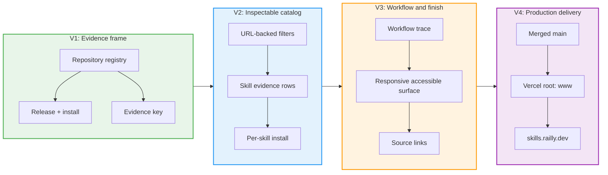

# Railly Skills landing page slices

| # | Slice | Mechanism | Affordances | Demo | Status |
|---|---|---|---|---|---|
| V1 | Evidence frame | B1, B2, B6 | U1, U2, U12, N1, N4, S1, S4 | Release facts and install command render from repository data and can be copied | Complete |
| V2 | Inspectable catalog | B3, B4 | U4-U11, N2-N4, S2-S4 | Search and filters update the visible skill set and shareable URL | Complete |
| V3 | Workflow and finish | B5, B7 | U3, U13, U14, N5, S5 | Workflow trace, responsive theme-aware finish, and source links work as one product surface | Complete |
| V4 | Production delivery | B8 | Production URL | Merged `main` deploys from `www/` and serves `skills.railly.dev` over HTTPS | Pending until deployment |

## Slice boundaries

